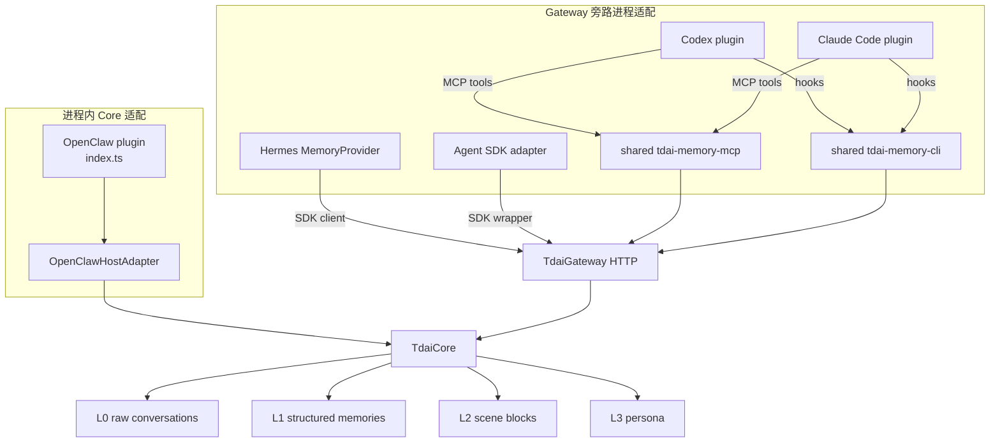
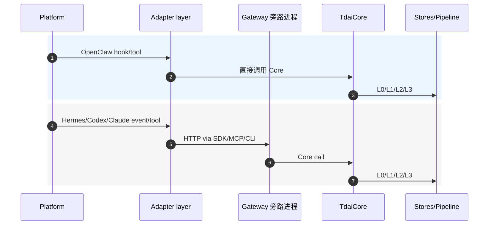
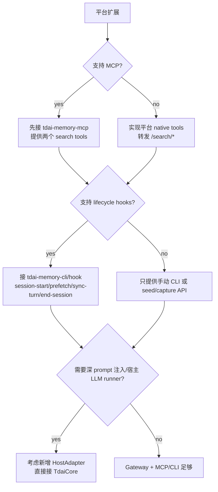

# 00 平台适配方式横向对比

## 范围

这里对比五类平台到 Memory Core 的接入路径。OpenClaw 在进程内直接调用 Core；Hermes 走 MemoryProvider + Gateway；Codex 和 Claude Code 客户端走 plugin + MCP + CLI/hooks + Gateway；自己写的 agent 应用可以走 Agent SDK adapter + Gateway。

## 结构图

## 接入路径

| 平台 | 接入模式 | 是否直接调 Core | 是否走 Gateway | Agent tool 面 | Hook/lifecycle 面 | 静态提示文件 |
| --- | --- | --- | --- | --- | --- | --- |
| Memory Core/Gateway | 基线能力 | Core 自身 | Gateway 可选 | HTTP `/search/*` | HTTP `/capture`, `/recall`, `/session/end` | 无 |
| OpenClaw | 原生进程内 plugin | 是 | 否 | `api.registerTool()` | `api.on(...)` | 无，直接 hook 注入 |
| Hermes | MemoryProvider | 否 | 是 | Hermes provider tools | `prefetch/sync_turn/on_session_end` | `system_prompt_block()` |
| Codex | Plugin + MCP + CLI/hooks | 否 | 是 | MCP `tdai_memory_search`, `tdai_conversation_search` | plugin hooks 调 CLI | `~/.codex/AGENTS.md` |
| Claude Code | Plugin + MCP + CLI/hooks | 否 | 是 | MCP `tdai_memory_search`, `tdai_conversation_search` | plugin hooks 调 CLI | `~/.claude/CLAUDE.md` |
| Agent SDK apps | TS SDK wrapper + Gateway | 否 | 是 | 应用自定义；可直接调 SDK wrapper search/client | SDK wrapper 内部 recall/capture/end | 无 |

## 能力覆盖

| 能力 | Core/Gateway | OpenClaw | Hermes | Codex | Claude Code |
| --- | --- | --- | --- | --- | --- |
| L0 capture | `POST /capture` / Core | `agent_end` 直接调 Core | `sync_turn` -> Gateway | `Stop` hook -> CLI -> Gateway | `Stop` hook -> CLI -> Gateway |
| L1 structured memory | Pipeline | Pipeline | Gateway 内 Pipeline | Gateway 内 Pipeline | Gateway 内 Pipeline |
| L2 scene block | Pipeline | Pipeline | Gateway 内 Pipeline | Gateway 内 Pipeline | Gateway 内 Pipeline |
| L3 persona | Pipeline | Pipeline | Gateway 内 Pipeline | Gateway 内 Pipeline | Gateway 内 Pipeline |
| pre-turn recall | `POST /recall` / Core | `before_prompt_build` | `prefetch()` | `UserPromptSubmit` hook -> CLI | `UserPromptSubmit` hook -> CLI |
| active search | `/search/*` | OpenClaw registered tools | Hermes provider tools | MCP tools | MCP tools |
| session flush | `/session/end` | process shutdown uses `destroy()` | `on_session_end` / `shutdown` | CLI `end-session` available, hooks currently focus session-start/prefetch/sync-turn | CLI `end-session` available, hooks currently focus session-start/prefetch/sync-turn |
| process shutdown | Gateway `stop()` | `gateway_stop` -> `core.destroy()` | 不主动停共享 Gateway | watchdog/idle 旁路进程 | watchdog/idle 旁路进程 |

## 数据流对比

## 适配层职责切分

| 职责 | 所在层 | 当前实现 |
| --- | --- | --- |
| 记忆语义 | Core + pipeline | `src/core/`, `src/utils/pipeline-manager.ts` |
| HTTP 路由 | Gateway | `src/gateway/server.ts` |
| agent 主动检索 | Tool/MCP 层 | OpenClaw/Hermes native tools，Codex/Claude shared MCP。 |
| 生命周期 capture | Hook/CLI/provider 层 | OpenClaw `agent_end`，Hermes `sync_turn`，Codex/Claude `Stop` hook。 |
| pre-turn recall | Hook/provider 层 | OpenClaw `before_prompt_build`，Hermes `prefetch`，Codex/Claude `prefetch` hook。 |
| 静态工具说明 | 平台全局 prompt 文件或 provider prompt block | Hermes `system_prompt_block`，Codex `AGENTS.md`，Claude `CLAUDE.md`。 |
| Gateway 进程管理 | supervisor/CLI runtime | Hermes supervisor，MCP supervisor，CLI `ensure_gateway_running` + watchdog。 |

## Tool 命名与暴露面

| 平台 | L1 tool | L0 tool | 暴露 health/session/capture 给 agent 吗 |
| --- | --- | --- | --- |
| OpenClaw | `tdai_memory_search` | `tdai_conversation_search` | 否 |
| Hermes | `memory_tencentdb_memory_search` | `memory_tencentdb_conversation_search` | 否 |
| Codex | `tdai_memory_search` | `tdai_conversation_search` | 否 |
| Claude Code | `tdai_memory_search` | `tdai_conversation_search` | 否 |

这里保持 search 与生命周期操作分离：search 属于 agent 业务检索面；health、session-start、prefetch、sync-turn、end-session 属于生命周期或旁路操作，不进入 agent tool 列表。

## 文件地图

| 文档 | 重点 |
| --- | --- |
| `01-memory-core-gateway.md` | Memory Core 和 Gateway 基线，所有平台共用。 |
| `02-openclaw-adapter.md` | OpenClaw 进程内 Core 适配。 |
| `03-hermes-adapter.md` | Hermes MemoryProvider + Gateway 旁路进程。 |
| `04-codex-plugin-adapter.md` | Codex plugin + shared MCP/CLI/hooks。 |
| `05-claude-code-plugin-adapter.md` | Claude Code plugin + shared MCP/CLI/hooks。 |
| `06-agent-sdk-adapter.md` | Codex SDK / Claude Code Agent SDK 的 TS wrapper。 |

## 接入形态

| 方案 | 适合处理的能力 | 额外成本 | 使用平台 |
| --- | --- | --- | --- |
| 进程内 HostAdapter | 深度 prompt 注入、宿主 LLM runner、低一层 HTTP 开销 | 绑定宿主 API，跨平台迁移需要重写事件层 | OpenClaw |
| Gateway 旁路进程 + provider | 复用 Core，宿主侧只需要 provider 和 HTTP client | 需要管理 Gateway 生命周期 | Hermes |
| Plugin + MCP + CLI/hooks | 多 agent 平台共享 search 和 lifecycle 适配包 | prompt 注入能力受平台 hooks 限制 | Codex、Claude Code |
| Agent SDK wrapper + Gateway | 自己写 agent 应用时直接包住 SDK 调用链，自动 recall/capture/stream | 需要应用代码改用 wrapper；不覆盖现成客户端 | Codex SDK、Claude Code Agent SDK |

## 平台扩展顺序

接入顺序：

1. 接 Gateway + MCP search，验证召回工具可用。
2. 接 hooks/CLI，验证 L0 capture 和 L1/L2/L3 pipeline。
3. 平台能稳定提供 prompt build 和 turn end 事件时，再评估进程内 HostAdapter。
