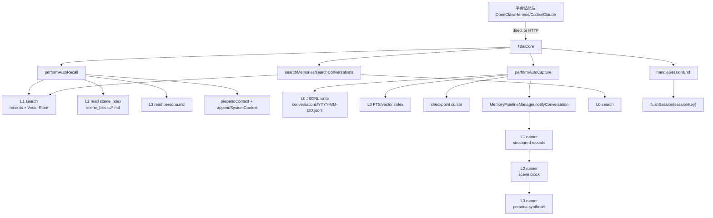
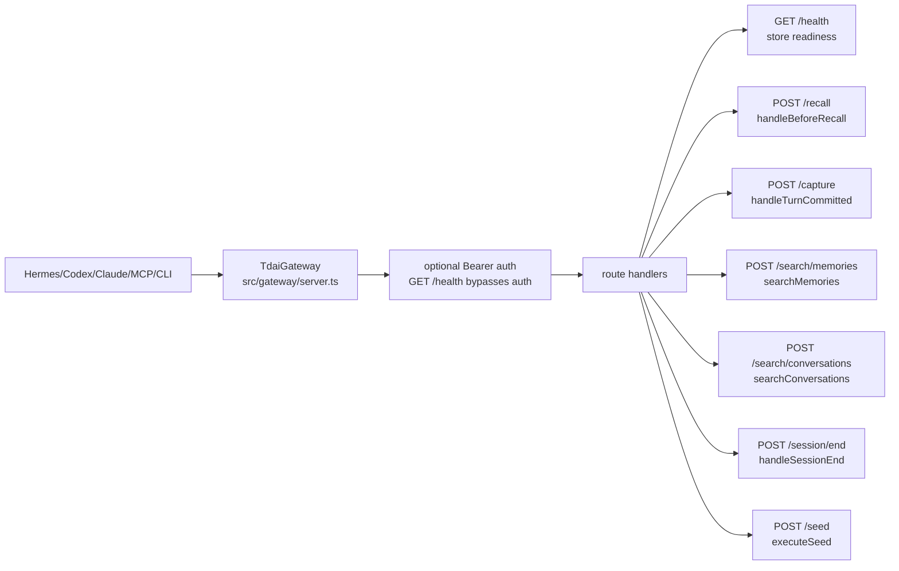
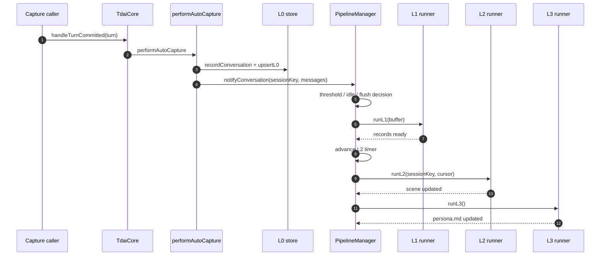

# 01 Memory Core 与 Gateway 基线

## 定位

`TdaiCore` 是 Memory 项目的平台无关入口。平台侧只负责把事件、tool call 或 HTTP 请求转换成 Core 的 recall、capture、search、session flush 调用；L0/L1/L2/L3 的落盘和调度逻辑集中在 Core hooks 与 pipeline 内。

## 源码入口

| 模块 | 文件 | 作用 |
| --- | --- | --- |
| Core facade | `src/core/tdai-core.ts` | 统一 recall、capture、search、session flush、destroy。 |
| Recall hook | `src/core/hooks/auto-recall.ts` | L1 搜索，L2 scene navigation，L3 persona，输出 prompt context。 |
| Capture hook | `src/core/hooks/auto-capture.ts` | 写 L0 conversation，写 L0 index，通知 pipeline。 |
| Pipeline manager | `src/utils/pipeline-manager.ts` | 管 L1 threshold/idle/flush，L2 delay/max interval，L3 global queue。 |
| Pipeline factory | `src/utils/pipeline-factory.ts` | 初始化 store、embedding、L1/L2/L3 runner。 |
| Gateway server | `src/gateway/server.ts` | 把 Core 能力暴露为 HTTP API。 |
| Standalone adapter | `src/adapters/standalone/host-adapter.ts` | Gateway 场景下给 Core 提供 logger、dataDir、LLM runner。 |

## Core 能力表

| Core 方法 | 平台语义 | 下游数据 |
| --- | --- | --- |
| `handleBeforeRecall(userText, sessionKey)` | pre-turn recall / prefetch | 读 L1、L2、L3，返回 `prependContext`、`appendSystemContext`。 |
| `handleTurnCommitted(turn)` | post-turn capture / sync-turn | 写 L0，更新 checkpoint，通知 L1/L2/L3 pipeline。 |
| `searchMemories(params)` | agent 主动搜长期结构化记忆 | 查 L1 records / VectorStore。 |
| `searchConversations(params)` | agent 主动搜原始对话 | 查 L0 conversations / VectorStore。 |
| `handleSessionEnd(sessionKey)` | 单个 conversation 结束 | flush 当前 session 的 L1 buffer。 |
| `destroy()` | 进程级关闭 | drain pipeline/background tasks，关闭 stores。 |

## 核心数据流

## Gateway API 映射

| HTTP API | 请求核心字段 | Core 方法 | 结果语义 |
| --- | --- | --- | --- |
| `GET /health` | none | store accessors | `ok/degraded`、uptime、store 状态。 |
| `POST /recall` | `query`, `session_key` | `handleBeforeRecall()` | 返回 context、strategy、memory_count。 |
| `POST /capture` | `user_content`, `assistant_content`, `session_key` | `handleTurnCommitted()` | 返回 L0 记录数和 scheduler 是否通知。 |
| `POST /search/memories` | `query`, `limit`, `type`, `scene` | `searchMemories()` | 返回格式化 L1 结果。 |
| `POST /search/conversations` | `query`, `limit`, `session_key` | `searchConversations()` | 返回格式化 L0 结果。 |
| `POST /session/end` | `session_key` | `handleSessionEnd()` | flush 当前 session。 |
| `POST /seed` | `data` | `executeSeed()` | 批量历史导入。 |

## L0/L1/L2/L3 触发图

## 适配边界

| 边界 | 原因 |
| --- | --- |
| 平台层不重写 L0/L1/L2/L3 语义 | 统一抽取、召回和 dedup 行为。 |
| `session end` 不等于 Gateway stop | session flush 只影响一个 session；Gateway 可能服务多平台/多会话。 |
| MCP 只承载查询面，不承载 capture | agent tool call 不应承担生命周期副作用。 |
| hooks/CLI 承载 capture 和 prefetch | 这些依赖宿主事件，不适合暴露给模型自由调用。 |
| Gateway health 作为旁路诊断 | 不进入 agent tool 列表，避免生命周期操作混入业务检索。 |

## 运行检查

| 验证目标 | 观察位置 |
| --- | --- |
| Gateway 已启动 | `GET /health`、Gateway log。 |
| L0 capture 生效 | `<dataDir>/conversations/YYYY-MM-DD.jsonl`。 |
| L1 extraction 生效 | `<dataDir>/records/YYYY-MM-DD.jsonl` 或 `tdai_memory_search`。 |
| L2 scene 生效 | `<dataDir>/scene_blocks/*.md`。 |
| L3 persona 生效 | `<dataDir>/persona.md`。 |
| session flush 生效 | Gateway log 中 `/session/end` 和 L1 queue drain。 |
