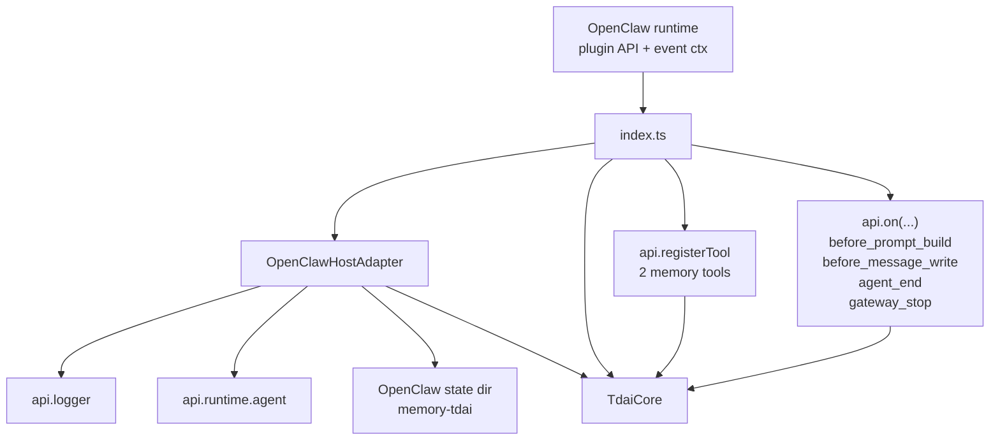
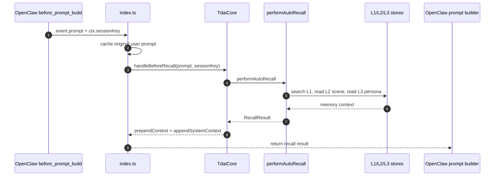
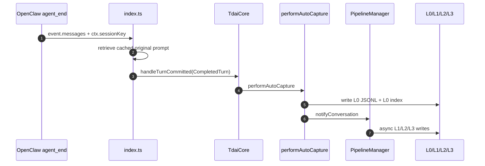
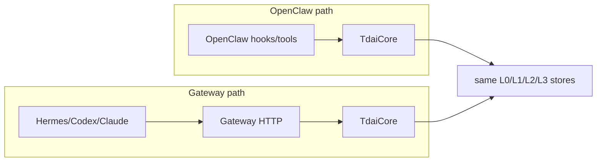

# 02 OpenClaw 适配方式

## 定位

OpenClaw 走进程内集成路径。plugin 初始化时创建 `OpenClawHostAdapter + TdaiCore`，后续 hooks 和 tools 都直接调用 Core，不经过 Gateway HTTP。

## 源码入口

| 入口 | 文件 | 作用 |
| --- | --- | --- |
| plugin root | `index.ts` | 读取配置、初始化 data dir、创建 Core、注册 hooks/tools。 |
| HostAdapter | `src/adapters/openclaw/host-adapter.ts` | 把 OpenClaw API 包装成 Core 的 `HostAdapter`。 |
| LLM runner | `src/adapters/openclaw/llm-runner.ts` | 用 OpenClaw runtime agent 执行 L1/L2/L3 需要的 LLM 调用。 |
| Core | `src/core/tdai-core.ts` | 被 OpenClaw plugin 直接调用。 |

## 适配层结构

## Hook 与 Tool 映射

| OpenClaw 事件/能力 | 源码位置 | Core 调用 | 数据语义 |
| --- | --- | --- | --- |
| `before_prompt_build` | `index.ts` hook registration | `core.handleBeforeRecall()` | pre-turn 召回 L1/L2/L3，上下注入给 agent。 |
| `before_message_write` | `index.ts` hook registration | 不调 Core | 清除 `<relevant-memories>`，避免召回片段污染历史消息。 |
| `agent_end` | `index.ts` hook registration | `core.handleTurnCommitted()` | capture 完整 turn，写 L0，触发 pipeline。 |
| `gateway_stop` | `index.ts` hook registration | `core.destroy()` | 进程级清理，flush pipeline，关闭 store/embedding。 |
| `tdai_memory_search` | `api.registerTool()` | `core.searchMemories()` | agent 主动搜索 L1。 |
| `tdai_conversation_search` | `api.registerTool()` | `core.searchConversations()` | agent 主动搜索 L0。 |

## Recall 数据流

## Capture 数据流

## 实现边界

| 维度 | 说明 |
| --- | --- |
| 调用方式 | 进程内直接调用 Core，无 HTTP 旁路进程。 |
| prompt 注入能力 | 最完整；可在 `before_prompt_build` 同时返回 `prependContext` 和 `appendSystemContext`。 |
| capture 完整度 | 可拿到 OpenClaw 的 `agent_end` messages 和 session ctx。 |
| 生命周期 | `gateway_stop` 在 OpenClaw 进程退出时调用 `core.destroy()`。 |
| 迁移边界 | 适配层绑定 OpenClaw plugin API；其他平台复用 Core 语义，而不是复用这层事件代码。 |

## 与 Gateway 路径的区别

## 运行检查

| 能力 | 检查位置 |
| --- | --- |
| Tools 注册 | OpenClaw tool 列表出现 `tdai_memory_search`、`tdai_conversation_search`。 |
| Recall hook | OpenClaw log 出现 `[before_prompt_build] Recall complete`。 |
| Capture hook | OpenClaw log 出现 `[agent_end] Auto-capture complete`。 |
| Strip hook | 历史消息里不应保留 `<relevant-memories>` block。 |
| 关闭清理 | `gateway_stop` log 中出现 `Cleanup finished`。 |
