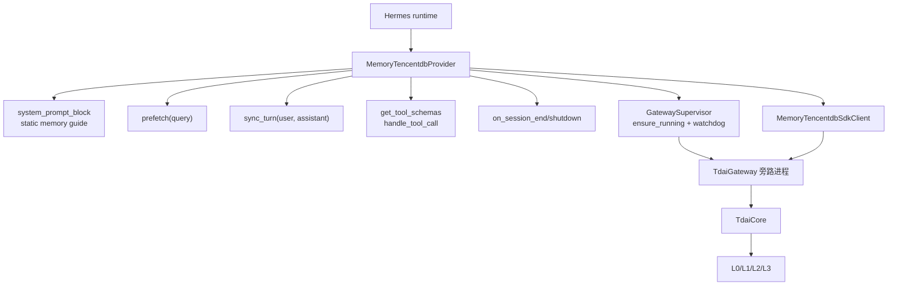
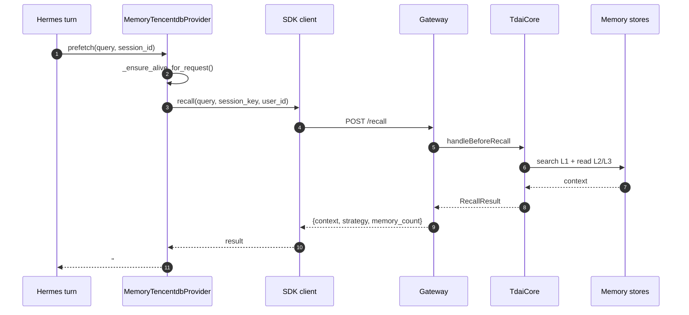
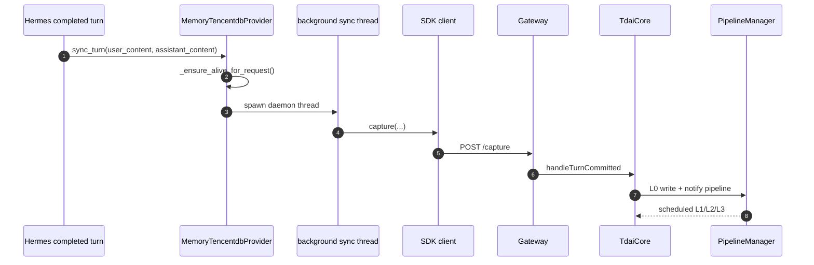
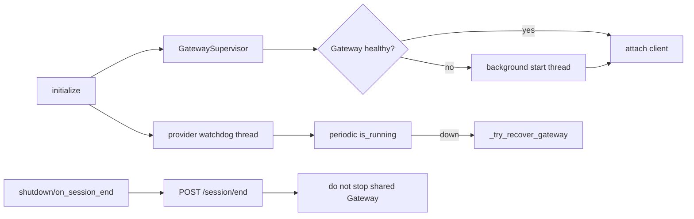

# 03 Hermes 适配方式

## 定位

Hermes 使用 `MemoryProvider` 接口接入。provider 不创建 `TdaiCore`，而是管理 Gateway 旁路进程，并通过 HTTP client 调用 `/recall`、`/capture`、`/search/*`、`/session/end`。

## 源码入口

| 入口 | 文件 | 作用 |
| --- | --- | --- |
| Provider | `hermes-plugin/memory/memory_tencentdb/__init__.py` | 实现 Hermes `MemoryProvider`，注册 prefetch、sync_turn、tool、session end。 |
| HTTP client | `hermes-plugin/memory/memory_tencentdb/client.py` | 封装 Gateway `/health`、`/recall`、`/capture`、`/search/*`、`/session/end`。 |
| Supervisor | `hermes-plugin/memory/memory_tencentdb/supervisor.py` | 管理 Gateway Node.js 旁路进程和健康检查。 |
| Gateway | `src/gateway/server.ts` | 承载 Core。 |

## Hermes Provider 能力映射

| Hermes MemoryProvider 方法 | 源码方法 | Gateway API | Core 方法 |
| --- | --- | --- | --- |
| 初始化 | `initialize(session_id, **kwargs)` | `GET /health`，必要时启动 Gateway | Gateway 内部初始化 Core。 |
| system prompt | `system_prompt_block()` | none | 静态提示，不读取动态记忆。 |
| pre-turn recall | `prefetch(query, session_id=...)` | `POST /recall` | `handleBeforeRecall()` |
| capture | `sync_turn(user_content, assistant_content, ...)` | `POST /capture` | `handleTurnCommitted()` |
| tool schema | `get_tool_schemas()` | none | 只声明工具 schema。 |
| tool call | `handle_tool_call(tool_name, args)` | `POST /search/memories` 或 `/search/conversations` | `searchMemories()` / `searchConversations()` |
| shutdown | `shutdown()` | `POST /session/end` | `handleSessionEnd()` |
| session end hook | `on_session_end(messages)` | `POST /session/end` | `handleSessionEnd()` |

## 架构图

## Recall 数据流

## Capture 数据流

## 生命周期与恢复

Hermes 当前区分两个关闭相关语义：

| 事件 | 当前处理 | 不做什么 |
| --- | --- | --- |
| `on_session_end` | 调 `/session/end` flush 当前 session | 不关闭 Gateway。 |
| `shutdown()` | 停 provider watchdog，等待 sync threads，调 `/session/end` | 不调用 supervisor shutdown，因为 Gateway 可能服务其他会话。 |

## Tool 命名差异

| Hermes tool | Gateway API | Codex/Claude MCP tool |
| --- | --- | --- |
| `memory_tencentdb_memory_search` | `/search/memories` | `tdai_memory_search` |
| `memory_tencentdb_conversation_search` | `/search/conversations` | `tdai_conversation_search` |

## 实现边界

| 维度 | 说明 |
| --- | --- |
| 集成深度 | 中等；使用 Hermes MemoryProvider 接口，但 Core 在 Gateway 旁路进程内。 |
| prompt 注入 | `system_prompt_block()` 静态说明 + `prefetch()` 动态 recall。 |
| capture | `sync_turn()` 后台线程异步 capture。 |
| self-heal | provider 里有 circuit breaker、lazy probe、watchdog 和 recovery。 |
| 生命周期依赖 | capture 和 flush 依赖 Hermes 稳定调用 `sync_turn`、`on_session_end` 或 `shutdown`。 |

## 运行检查

| 能力 | 检查位置 |
| --- | --- |
| Provider 注册 | Hermes memory provider 列表出现 `memory_tencentdb`。 |
| Gateway ready | provider log 出现 `Gateway ready` 或 `Gateway already running`。 |
| Recall | `prefetch()` 返回 `## memory-tencentdb Memory`。 |
| Capture | Gateway log 出现 `/capture`，L0 JSONL 追加。 |
| Tool call | Hermes tool call 返回 Gateway JSON 搜索结果。 |
| Session flush | `on_session_end` 触发 `/session/end`。 |
