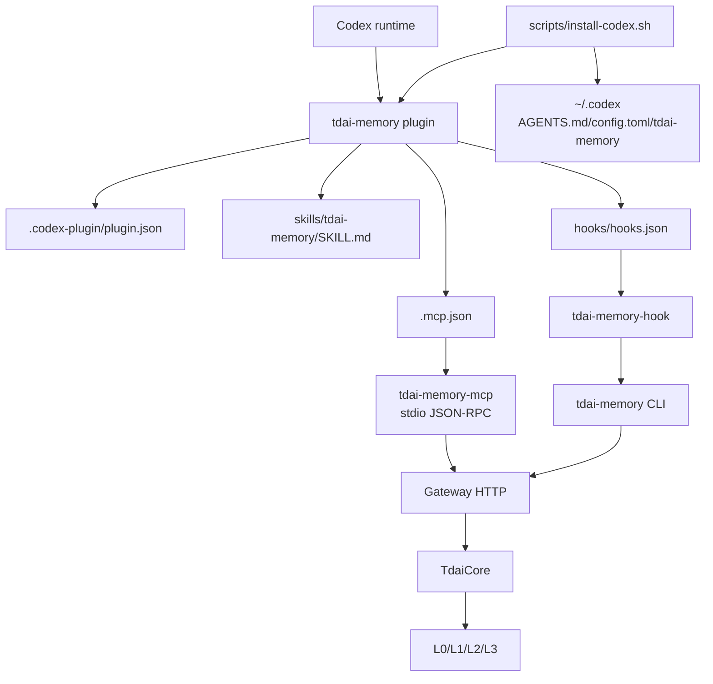
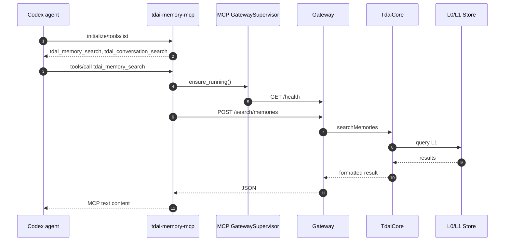
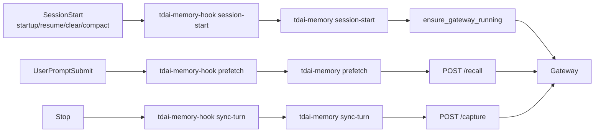

# 04 Codex Plugin 适配方式

## 定位

Codex 适配由 plugin manifest、MCP server、hooks 和安装脚本组成。MCP 提供 agent 主动搜索；hooks 通过 CLI 处理 Gateway 启动、prefetch 和 capture；安装脚本负责写入 `~/.codex` 与插件目录中的运行配置。

## 源码入口

| 入口 | 文件 | 作用 |
| --- | --- | --- |
| Plugin manifest | `plugins/tdai-memory/.codex-plugin/plugin.json` | 声明 Codex plugin、MCP、skills、hooks。 |
| MCP 配置 | `plugins/tdai-memory/.mcp.json` | 配置 `python3 -m tdai_memory_mcp`。 |
| Hooks 配置 | `plugins/tdai-memory/hooks/hooks.json` | Codex hooks 调 `python3 -m tdai_memory_cli.hook ...`。 |
| Skill | `plugins/tdai-memory/skills/tdai-memory/SKILL.md` | 给 Codex 说明 MCP/CLI 使用边界。 |
| 安装脚本 | `scripts/install-codex.sh` | 安装 Python 包、注册 plugin/MCP、写 AGENTS.md、写 hooks、写 config.toml approval。 |
| 共用 MCP | `packages/tdai-memory-mcp/` | stdio MCP server。 |
| 共用 CLI | `packages/tdai-memory-cli/` | hook wrapper 和 lifecycle CLI。 |

## Codex 适配结构

## Manifest 关系

| manifest 字段 | 当前值/路径 | 作用 |
| --- | --- | --- |
| `name` | `tdai-memory` | Codex plugin 名称。 |
| `mcpServers` | `./.mcp.json` | 注册 MCP server。 |
| `skills` | `./skills/` | 提供 `tdai-memory` skill。 |
| `hooks` | `./hooks/hooks.json` | 提供 Codex plugin-bundled hooks。 |
| `interface.capabilities` | `MCP`, `Skills`, `Memory` | Codex UI/marketplace 能力描述。 |

## Codex MCP 数据流

## Codex hooks 数据流

| Hook | 命令 | 目的 |
| --- | --- | --- |
| `SessionStart` | `tdai_memory_cli.hook session-start` | 启动或确认 Gateway。 |
| `UserPromptSubmit` | `tdai_memory_cli.hook prefetch` | 调 `/recall`，预取 memory context。 |
| `Stop` | `tdai_memory_cli.hook sync-turn` | 从 transcript/event 提取 user/assistant turn，调 `/capture`。 |

## 安装脚本职责

| 步骤 | `scripts/install-codex.sh` 行为 |
| --- | --- |
| Python package | editable/install shared MCP 和 CLI 包。 |
| Gateway config | 默认写到 `~/.codex/tdai-memory/tdai-gateway.yaml`。 |
| Memory data | 默认 `~/.codex/tdai-memory/data`。 |
| AGENTS.md | 在 `~/.codex/AGENTS.md` 幂等写入 TDAI 记忆说明块。 |
| Hooks | 写 `plugins/tdai-memory/hooks/hooks.json`，清理旧 `~/.codex/hooks.json` 的 tdai legacy hook。 |
| MCP | `codex mcp add tdai-memory ... python3 -m tdai_memory_mcp`。 |
| Plugin | `codex plugin marketplace add` + `codex plugin add tdai-memory@tdai-memory-local`。 |
| Approval | 更新 `~/.codex/config.toml`，配置 MCP server 和 tool approval。 |

## Codex 默认运行位置

| 类型 | 默认路径/值 |
| --- | --- |
| Gateway URL | `http://127.0.0.1:8420` |
| Data dir | `~/.codex/tdai-memory/data` |
| Gateway config | `~/.codex/tdai-memory/tdai-gateway.yaml` |
| Hook log | `~/.codex/tdai-memory/logs/hooks.jsonl` |
| Runtime dir | `~/.codex/tdai-memory/runtime` |
| User guide | `~/.codex/AGENTS.md` |

## 实现边界

| 维度 | 说明 |
| --- | --- |
| Tool 面 | 只用 MCP 暴露 `tdai_memory_search` / `tdai_conversation_search`。 |
| Hook 面 | 用 CLI 做 session-start、prefetch、sync-turn。 |
| Prompt 注入 | 主要依赖 `AGENTS.md` 静态说明；runtime prefetch 能否注入取决于 Codex hook 支持。 |
| 生命周期 | Gateway 由 hook/CLI lazy start，runtime heartbeat + watchdog 可做 idle shutdown。 |
| 与 Core 关系 | 不直接调 Core，全部经 Gateway HTTP。 |

## 运行检查

| 能力 | 检查位置 |
| --- | --- |
| Plugin 已安装 | `codex plugin list` 或 Codex plugin UI。 |
| MCP 可用 | Codex 能看到 `tdai_memory_search`、`tdai_conversation_search`。 |
| Hooks 生效 | `~/.codex/tdai-memory/logs/hooks.jsonl` 有 `prepared/completed`。 |
| Gateway 启动 | `~/.codex/tdai-memory/logs/gateway.log` 或 `/health`。 |
| Capture 成功 | `~/.codex/tdai-memory/data/conversations/*.jsonl` 有 turn。 |
| Search 成功 | MCP tool 返回 L1/L0 命中。 |
