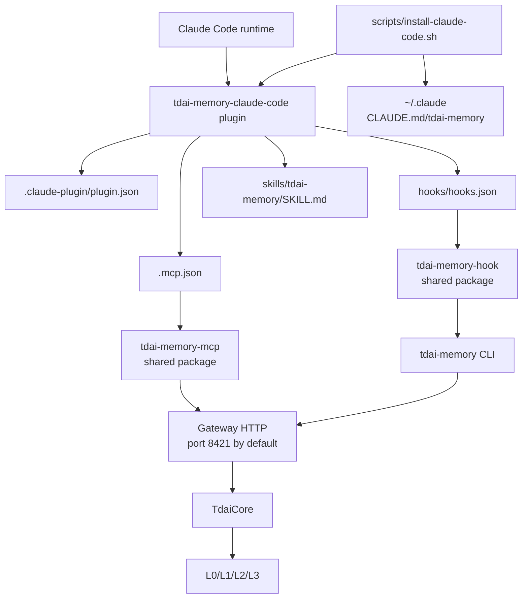
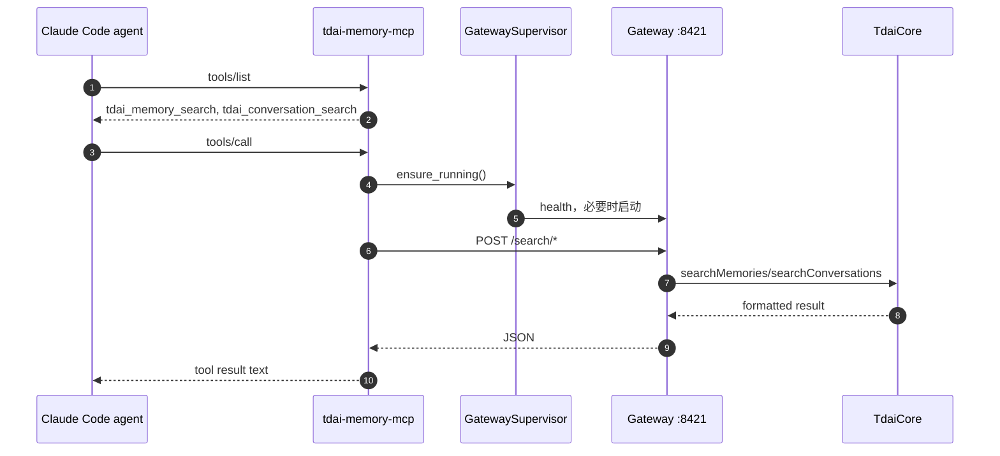
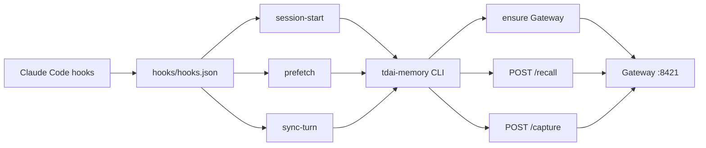

# 05 Claude Code Plugin 适配方式

## 定位

Claude Code 适配复用 `packages/tdai-memory-mcp` 和 `packages/tdai-memory-cli`。与 Codex 的差异集中在 plugin manifest 目录、用户级提示文件、默认端口和安装命令。

## 源码入口

| 入口 | 文件 | 作用 |
| --- | --- | --- |
| Plugin manifest | `plugins/tdai-memory-claude-code/.claude-plugin/plugin.json` | 声明 Claude Code plugin 基本信息。 |
| MCP 配置 | `plugins/tdai-memory-claude-code/.mcp.json` | 配置 `python3 -m tdai_memory_mcp` 和 Claude 默认 env。 |
| Hooks 配置 | `plugins/tdai-memory-claude-code/hooks/hooks.json` | Claude hooks 调共用 hook CLI。 |
| Skill | `plugins/tdai-memory-claude-code/skills/tdai-memory/SKILL.md` | Claude Code 侧 memory 使用说明。 |
| 安装脚本 | `scripts/install-claude-code.sh` | 安装共用 packages，写 `CLAUDE.md`，写 plugin MCP/hooks，安装 plugin。 |
| 共用 MCP | `packages/tdai-memory-mcp/` | 与 Codex 共用。 |
| 共用 CLI | `packages/tdai-memory-cli/` | 与 Codex 共用。 |

## Claude Code 适配结构

## 与 Codex 的核心差异

| 维度 | Codex | Claude Code |
| --- | --- | --- |
| Plugin manifest 目录 | `.codex-plugin/plugin.json` | `.claude-plugin/plugin.json` |
| 默认用户配置目录 | `~/.codex` | `~/.claude` |
| 静态提示文件 | `~/.codex/AGENTS.md` | `~/.claude/CLAUDE.md` |
| 默认 Gateway URL | `http://127.0.0.1:8420` | `http://127.0.0.1:8421` |
| Plugin package | `plugins/tdai-memory` | `plugins/tdai-memory-claude-code` |
| 安装脚本 | `scripts/install-codex.sh` | `scripts/install-claude-code.sh` |
| MCP/CLI | 同一套 packages | 同一套 packages |

## MCP 数据流

## Hooks 数据流

## 安装脚本职责

| 步骤 | `scripts/install-claude-code.sh` 行为 |
| --- | --- |
| Python package | 安装/暴露 shared MCP 和 CLI 包。 |
| Gateway config | 默认写到 `~/.claude/tdai-memory/tdai-gateway.yaml`。 |
| Memory data | 默认 `~/.claude/tdai-memory/data`。 |
| CLAUDE.md | 在 `~/.claude/CLAUDE.md` 幂等写入 TDAI 记忆说明块。 |
| Plugin MCP | 写 `plugins/tdai-memory-claude-code/.mcp.json`。 |
| Plugin hooks | 写 `plugins/tdai-memory-claude-code/hooks/hooks.json`。 |
| Plugin install | `claude plugin marketplace add` + `claude plugin install`。 |

## Claude Code 默认运行位置

| 类型 | 默认路径/值 |
| --- | --- |
| Gateway URL | `http://127.0.0.1:8421` |
| Data dir | `~/.claude/tdai-memory/data` |
| Gateway config | `~/.claude/tdai-memory/tdai-gateway.yaml` |
| Hook log | `~/.claude/tdai-memory/logs/hooks.jsonl` |
| Runtime dir | `~/.claude/tdai-memory/runtime` |
| User guide | `~/.claude/CLAUDE.md` |

## 实现边界

| 维度 | 说明 |
| --- | --- |
| 复用度 | MCP/CLI 完全复用 Codex 适配包。 |
| 差异面 | manifest、安装命令、用户目录、默认端口。 |
| Prompt 说明 | 写入 `CLAUDE.md`，用于告诉模型主动用 MCP 查记忆。 |
| Capture | 依赖 Claude Code hooks 的 Stop/UserPromptSubmit/SessionStart 事件。 |
| Hook schema | Claude Code plugin/hook schema 与 Codex 不完全一致，`hook.py` 通过多字段解析做兼容。 |

## 运行检查

| 能力 | 检查位置 |
| --- | --- |
| Plugin 已安装 | `claude plugin list` 或 Claude Code plugin UI。 |
| MCP 可用 | Claude Code 能看到 `tdai_memory_search`、`tdai_conversation_search`。 |
| Hooks 生效 | `~/.claude/tdai-memory/logs/hooks.jsonl` 有 hook 记录。 |
| Gateway 启动 | `GET http://127.0.0.1:8421/health`。 |
| Capture 成功 | `~/.claude/tdai-memory/data/conversations/*.jsonl` 有 turn。 |
| Search 成功 | MCP tool 返回 L1/L0 命中。 |
