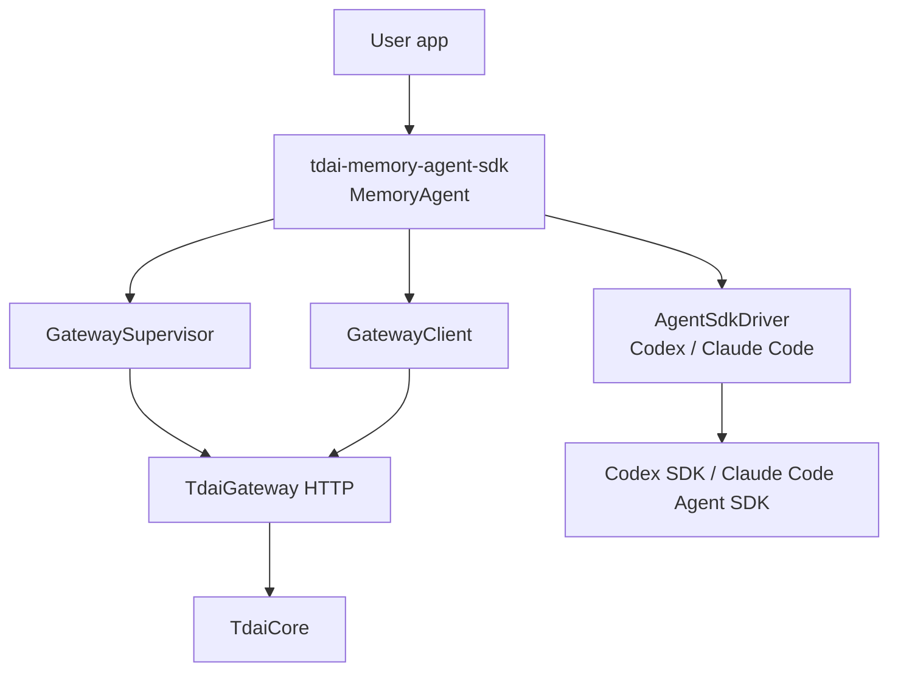
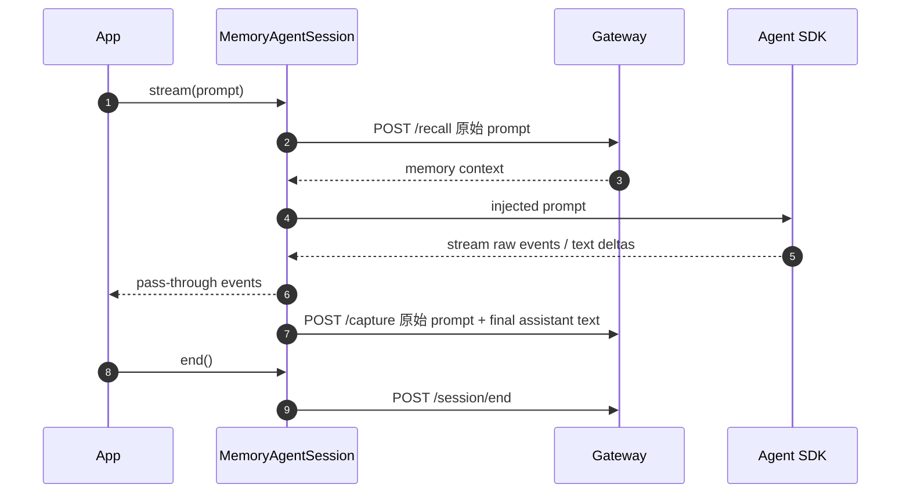

# 06 Agent SDK 适配

## 范围

Agent SDK 适配面向“自己写 agent 应用”的场景，而不是改造现成 Codex / Claude Code 客户端。

首版只做 TypeScript：

- Codex SDK driver
- Claude Code Agent SDK driver
- 共享 Memory wrapper
- TypeScript Gateway supervisor
- 单测、fake Gateway 测试、真实 Gateway/真实 SDK gated E2E

不做 MCP、plugin、hooks、IDE agent、Python SDK，也不改 Memory Core/Gateway 业务逻辑。

## 结构



## 每轮数据流



关键点：

- capture 记录原始用户 prompt，不记录注入 Memory 后的 prompt。
- stream 透传底层 SDK raw event，同时尽量提取 `agent.text.delta`。
- capture 在 stream 完整结束后执行，不做增量 capture。
- `session.end()` 只 flush 当前 Memory session；`agent.close()` 才关闭本 SDK 启动的 Gateway。

## 默认运行目录

默认按 SDK 隔离：

| SDK | Gateway URL | Root |
| --- | --- | --- |
| Codex SDK | `http://127.0.0.1:8420` | `~/.tdai-memory/codex-sdk/` |
| Claude Code Agent SDK | `http://127.0.0.1:8421` | `~/.tdai-memory/claude-code-sdk/` |

目录内容：

```text
~/.tdai-memory/<agent-sdk-name>/
  tdai-gateway.yaml
  data/
  logs/
  runtime/
```

共享 Memory 需要显式传 `dataDir`，避免两个 SDK 默认互相污染。

## Gateway Supervisor

默认命令：

```bash
node --import tsx src/gateway/server.ts
```

Supervisor 行为：

- 先健康检查 Gateway。
- 如果不可达，校验/生成 SDK 专属 `tdai-gateway.yaml`。
- 配置不存在时生成 Ollama 默认配置：`gemma4:latest` + `bge-m3:latest`。
- 配置已存在时不覆盖。
- 已有配置的 `server.port` 或 `data.baseDir` 和 SDK 预期不一致时 fail fast。
- 只关闭自己启动的 Gateway，不杀外部已有进程。
- stdout/stderr 写入 SDK 专属 `logs/`。

## SDK Driver 边界

共享接口：

```ts
interface AgentSdkDriver {
  readonly name: string;
  startSession(options?: AgentSdkSessionOptions): Promise<AgentSdkSession>;
}

interface AgentSdkSession {
  stream(input: AgentSdkRunInput): AsyncIterable<AgentSdkStreamEvent>;
  run?(input: AgentSdkRunInput): Promise<AgentSdkRunResult>;
  close?(): Promise<void>;
}
```

Memory wrapper 只依赖这个接口，不直接依赖 Codex/Claude Code SDK。

`@openai/codex-sdk` 和 `@anthropic-ai/claude-agent-sdk` 是 optional peer dependency。只有使用对应 driver 时才动态导入；未安装时给出明确错误。

## 和 MCP/plugin 方案的关系

SDK 方案不替代 MCP/plugin/hooks：

- 你在写自己的 agent 应用，并直接调用 Codex SDK / Claude Code Agent SDK：用 Agent SDK adapter。
- 你在使用现成 Codex / Claude Code 客户端，希望自动接入 Memory：用 plugin + MCP + hooks。
- 只需要 agent 主动检索 Memory：MCP 足够。
- 需要每轮自动 recall/capture 且你控制 SDK 调用链：SDK adapter 更直接。

## 测试策略

| 层级 | 目的 | 默认执行 |
| --- | --- | --- |
| Unit | 类型、prompt 注入、fail-open/strict、配置生成 | 是 |
| Fake Gateway | HTTP shape 与 auth header | 是 |
| Real Gateway E2E | supervisor + Gateway + local Ollama | `TDAI_AGENT_SDK_E2E=1` |
| Real Codex SDK E2E | 真实 SDK smoke + capture | `TDAI_AGENT_SDK_E2E=1 TDAI_AGENT_SDK_REAL_CODEX=1` |
| Real Claude Code SDK E2E | 真实 SDK smoke + capture | `TDAI_AGENT_SDK_E2E=1 TDAI_AGENT_SDK_REAL_CLAUDE_CODE=1` |

普通 Real Gateway E2E 使用 `/tmp/tdai-memory-agent-sdk-e2e-*` 隔离目录，结束后清理。打开真实 SDK gate 后，记录写入约定的 `~/.tdai-memory/<agent sdk name>/data`，缺依赖或本机 SDK 未登录应失败，而不是静默 skip。
