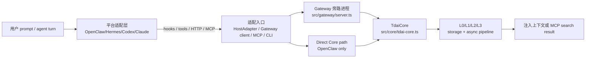

# 00 范围

这组文档记录 TencentDB Agent Memory 的长期记忆核心链路，以及 OpenClaw、Hermes、Codex、Claude Code 四个平台适配层到 Core/Gateway 的映射关系。
范围不包含 context offload、seed 批量导入深层实现、TCVDB 云端部署细节和 LLM prompt 调参。

## 覆盖范围

| 类型 | 本次覆盖 |
| --- | --- |
| 启动链路 | Gateway 启动、plugin install 生成配置、MCP server stdio 启动 |
| 请求链路 | Gateway `/recall`、`/capture`、`/search/*`、`/session/end` |
| 后台任务 | L1/L2/L3 pipeline timers、queues、watchdog idle shutdown |
| CLI 命令 | `tdai-memory session-start/prefetch/sync-turn/end-session` |
| 平台 hook | OpenClaw hooks、Hermes MemoryProvider、Codex/Claude hook wrapper |
| 核心能力 | L0 捕获、L1 抽取、L2 scene、L3 persona、MCP 检索 |
| 存储路径 | JSONL、SQLite/VectorStore、checkpoint、scene blocks、persona |

## 入口速查

| 问题 | 位置 |
| --- | --- |
| 核心引擎在哪里？ | `src/core/tdai-core.ts`，平台无关的 Core facade。 |
| Gateway 做什么？ | `src/gateway/server.ts` 将 Core 暴露为 HTTP 旁路进程。 |
| MCP 暴露哪些能力？ | 只暴露 `tdai_memory_search` 和 `tdai_conversation_search`。 |
| hooks/CLI 做什么？ | 启动 Gateway、prefetch、capture、end-session flush。 |
| L0/1/2/3 何时产生？ | L0 同步 capture；L1 threshold/idle/flush；L2 delay/max interval；L3 在 L2 后全局触发。 |
| 平台扩展入口 | 先接 Gateway + shared MCP/CLI；需要进程内深集成时再增加 `HostAdapter`。 |

## 边界图

本目录使用同一组场景值贯穿调试：

| 字段 | 值 |
| --- | --- |
| `userId` | `小明` |
| `sessionKey` | `codex-rhino-bird-session` |
| `sessionId` | `codex-rhino-bird-session-id` |
| `userPrompt` | `Rhino-Bird 架构拆解测试：请记住小明偏好中文结论优先，并要求 Gateway/Core/Hermes/OpenClaw 原始代码不改。` |
| `assistantContent` | `ACK Rhino-Bird memory architecture scenario.` |
| `gatewayUrl` | `http://127.0.0.1:8420` |
