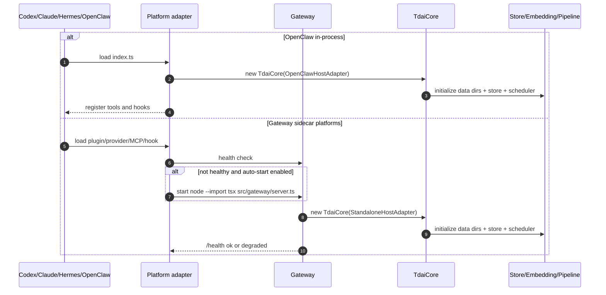

# 01 Entrypoints

## Entrypoint Map

| External event | Code entry | Initializes | Notes |
| --- | --- | --- | --- |
| OpenClaw loads plugin | `index.ts` `register()` | `OpenClawHostAdapter`, `TdaiCore`, tools, hooks | 进程内路径，不需要 Gateway HTTP。 |
| OpenClaw pre-turn | `index.ts` `api.on("before_prompt_build")` | recall cache, embedding warmup | 调 `core.handleBeforeRecall()`。 |
| OpenClaw post-turn | `index.ts` `api.on("agent_end")` | scheduler start, L0 capture | 调 `core.handleTurnCommitted()`。 |
| OpenClaw shutdown | `index.ts` `api.on("gateway_stop")` | cleanup | 调 `core.destroy()`。 |
| Gateway process starts | `src/gateway/server.ts` `main()` | `TdaiGateway`, `StandaloneHostAdapter`, `TdaiCore` | `node --import tsx src/gateway/server.ts`。 |
| HTTP recall/capture/search | `TdaiGateway.handleRequest()` | route handlers | `/recall`, `/capture`, `/search/*`, `/session/end`。 |
| Hermes provider loads | `hermes-plugin/.../__init__.py` `register(ctx)` | `MemoryTencentdbProvider` | Hermes native MemoryProvider。 |
| Hermes session init | `MemoryTencentdbProvider.initialize()` | `GatewaySupervisor`, SDK client, watchdog | 后台拉起或连接 Gateway。 |
| Codex/Claude MCP starts | `packages/tdai-memory-mcp/.../__main__.py` | `McpServer` | stdio JSON-RPC server。 |
| MCP tool call | `protocol.py` `tools/call` | `GatewaySupervisor.ensure_running()` | 调 Gateway `/search/*`。 |
| Codex/Claude hook fires | `tdai-memory-hook` `hook.py` | event parsing | stdin JSON 转 CLI args。 |
| CLI command | `tdai-memory` `__main__.py` | config + Gateway health/start | `session-start/prefetch/sync-turn/end-session`。 |

## Startup Sequence

## External Event To Handler

| Event | Handler | First breakpoint/log |
| --- | --- | --- |
| 用户提交 prompt | Codex/Claude hook `prefetch` -> `hook.py:_prefetch_args()` | `TDAI_HOOK_LOG` JSONL `phase=prepared` |
| turn 完成 | Codex/Claude hook `sync-turn` -> `hook.py:_sync_turn_args()` | `TDAI_HOOK_LOG` JSONL + Gateway `Capture completed` |
| agent 主动查记忆 | MCP `protocol.py:McpServer.handle_message()` | `tools/call` branch |
| Gateway 收请求 | `server.ts:handleRequest()` | `Request error [METHOD path]` 或 route-specific logs |
| Core recall | `tdai-core.ts:handleBeforeRecall()` | `[memory-tdai] [recall] Recall timing` |
| Core capture | `tdai-core.ts:handleTurnCommitted()` | `[memory-tdai] [capture] L0 recorded` |
| L1 抽取 | `pipeline-manager.ts:runL1()` + `pipeline-factory.ts:createL1Runner()` | `[pipeline] L1 running`, `[l1] Processing ...` |
| L2/L3 | `pipeline-manager.ts:runL2()/runL3()` | `[L2] Extraction complete`, `[L3] Persona generation succeeded` |

## Project Metadata

| File | Purpose |
| --- | --- |
| `package.json` | Node/TypeScript package, scripts, runtime deps。 |
| `index.ts` | OpenClaw plugin root。 |
| `src/gateway/server.ts` | Gateway HTTP server root。 |
| `packages/tdai-memory-mcp/pyproject.toml` | MCP Python package。 |
| `packages/tdai-memory-cli/pyproject.toml` | CLI/hook Python package。 |
| `plugins/tdai-memory/.codex-plugin/plugin.json` | Codex plugin manifest。 |
| `plugins/tdai-memory-claude-code/.claude-plugin/plugin.json` | Claude Code plugin manifest。 |

