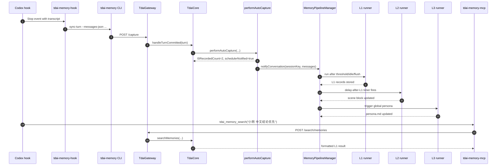

# 02 主链路

## 场景值

| 字段 | 值 |
| --- | --- |
| `userId` | `小明` |
| `sessionKey` | `codex-rhino-bird-session` |
| `sessionId` | `codex-rhino-bird-session-id` |
| `userPrompt` | `Rhino-Bird 架构拆解测试：请记住小明偏好中文结论优先，并要求 Gateway/Core/Hermes/OpenClaw 原始代码不改。` |
| `assistantContent` | `ACK Rhino-Bird memory architecture scenario.` |
| L0 结果 | 两条 raw messages 被写入 conversations JSONL 和 L0 index。 |
| L1 结果 | 偏好、项目约束、事件事实被抽成 structured memory。 |
| L2 结果 | 形成插件架构/工程约束相关 scene block。 |
| L3 结果 | `persona.md` 汇总用户稳定偏好与长期画像。 |

## 主流程时序

## 调用链

| 步骤 | 模块 | 输入 | 输出 | 读取 | 写入 | 失败表现 |
| --- | --- | --- | --- | --- | --- | --- |
| 1 | `hook.py:run_hook()` | stdin hook JSON | CLI argv | stdin | hook log | 非 strict 时返回 success 并写 stderr。 |
| 2 | `__main__.py:run_cli()` | `sync-turn` args | capture 格式化结果 | env config | heartbeat | 参数缺失返回 code 1/2。 |
| 3 | `gateway_start.py:ensure_gateway_running()` | `AdapterConfig` | `started/already-running` | `/health`, pid files | gateway pid, logs | health 超时抛错。 |
| 4 | `server.ts:handleCapture()` | HTTP JSON | `{l0_recorded, scheduler_notified}` | request body | logs | 缺字段 400。 |
| 5 | `tdai-core.ts:handleTurnCommitted()` | `CompletedTurn` | `CaptureResult` | storeReady, checkpoint | bg task set | store 初始化失败可降级。 |
| 6 | `auto-capture.ts:performAutoCapture()` | raw messages | filtered messages + counts | checkpoint cursor | L0 JSONL, L0 index | L0 文件写失败仍可返回 filtered messages。 |
| 7 | `pipeline-manager.ts:notifyConversation()` | filtered messages | 调度任务 | session state | message buffer, checkpoint | filter 命中则 skip。 |
| 8 | `pipeline-manager.ts:runL1()` | buffered messages | L1 完成 | buffer/session state | state/cursor | L1 失败恢复 buffer 并 retry。 |
| 9 | `pipeline-factory.ts:createL1Runner()` | sessionKey | records stored | L0 DB/JSONL | L1 records, checkpoint | 无 LLM runner 则 processed=0。 |
| 10 | `pipeline-manager.ts:runL2/runL3()` | L1 records | scenes/persona | L1 records, profile baseline | scene_blocks, persona.md | L2 失败 arm max interval retry。 |
| 11 | `protocol.py:tools/call` | MCP args | MCP text result | Gateway health | none | tool error returns `isError` text。 |

## 输出与落盘

| 输出 | 位置 |
| --- | --- |
| 原始对话 | `<dataDir>/conversations/YYYY-MM-DD.jsonl` |
| L0 检索索引 | `<dataDir>/.metadata` 下的 SQLite/VectorStore，或配置的外部 backend |
| 结构化记忆 | `<dataDir>/records/YYYY-MM-DD.jsonl`，也可能写入 VectorStore L1 表 |
| 场景块 | `<dataDir>/scene_blocks/*.md` |
| 用户画像 | `<dataDir>/persona.md` |
| MCP 召回文本 | MCP `tools/call` response content |
| Hook 诊断 | `TDAI_HOOK_LOG`，通常是 `~/.codex/tdai-memory/logs/hooks.jsonl` |
