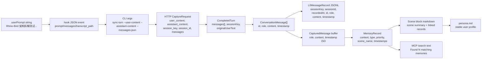

# 03 Data Flow

## Data Transformation Diagram

## Shape Changes

| Boundary | Input shape | Output shape | Added | Filtered / dropped |
| --- | --- | --- | --- | --- |
| Hook stdin -> `hook.py` | Platform-specific JSON | normalized CLI argv | command, identity args | unknown keys ignored |
| `hook.py` -> CLI | `["sync-turn", ...]` | argparse namespace | defaults from env | invalid/missing required fails |
| CLI -> Gateway | Python dict | HTTP JSON body | `session_key`, `user_id`, optional `messages` | empty optional values omitted only in MCP client path |
| Gateway -> Core | HTTP body | `CompletedTurn` | fallback messages if absent | request rejected if required fields absent |
| Core -> auto-capture | `CompletedTurn` | capture params | cfg, logger, scheduler, store | none |
| l0-recorder extraction | raw message objects | `ConversationMessage[]` | generated id, timestamp fallback | non user/assistant, empty content |
| sanitize/filter | `ConversationMessage[]` | filtered messages | cleaned content | injected tags, code blocks in assistant, low-value text |
| JSONL write | filtered messages | `L0MessageRecord` lines | `sessionKey`, `sessionId`, `recordedAt` | none after filtering |
| scheduler notify | filtered messages | `CapturedMessage[]` buffer | ISO timestamp | skipped sessions |
| L1 runner | L0 grouped messages | structured L1 records | type/priority/scene/time | dedup/conflict handling may drop duplicates |
| L2 runner | L1 records | scene markdown/index | scene grouping | no new records -> skipped |
| L3 runner | scenes/profile state | persona markdown | synthesized stable profile | no trigger -> skipped |
| MCP search | tool args | formatted text | score, scene, priority | type/scene filters |

## Concrete Scenario Values At Boundaries

| Boundary | Value |
| --- | --- |
| Hook user content | `Rhino-Bird 架构拆解测试：请记住小明偏好中文结论优先，并要求 Gateway/Core/Hermes/OpenClaw 原始代码不改。` |
| CLI session key | `codex-rhino-bird-session` |
| Capture request | `{user_content, assistant_content, session_key, session_id, messages}` |
| L0 user line | role=`user`, content includes `中文结论优先` and `原始代码不改` |
| L0 assistant line | role=`assistant`, content=`ACK Rhino-Bird memory architecture scenario.` |
| Expected L1 types | `instruction`, `persona`, `episodic` |
| Search query | `小明 中文结论优先 Gateway Core Hermes OpenClaw 不改` |

## Failure Visibility

| Failure | Visible symptom | Where data stops |
| --- | --- | --- |
| Hook event lacks prompt/messages | hook stderr says incomplete turn | before CLI capture |
| Gateway not healthy and auto-start disabled | CLI returns Gateway unreachable | before HTTP |
| `/capture` missing required fields | HTTP 400 | before Core |
| L0 all filtered out | `l0_recorded=0`, no scheduler work | before L1 |
| embedding missing | FTS-only or degraded search | L0/L1 still written, vector ranking absent |
| L1 LLM failure | L0 exists, no records | pipeline buffer restored/retry |
| L2 timer not fired yet | L1 exists, no scene block | waiting in scheduler |
| L3 trigger not satisfied | L2 exists, no updated persona | PersonaTrigger returns false |

