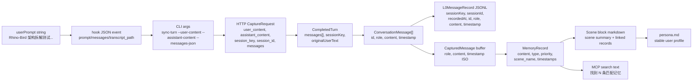

# 03 数据流

## 数据转换图

## 数据形态变化

| 边界 | 输入形态 | 输出形态 | 补充字段 | 过滤或丢弃 |
| --- | --- | --- | --- | --- |
| Hook stdin -> `hook.py` | 平台事件 JSON | 归一后的 CLI argv | command, identity args | 未识别字段忽略 |
| `hook.py` -> CLI | `["sync-turn", ...]` | argparse namespace | env 默认值 | 必填参数缺失时失败 |
| CLI -> Gateway | Python dict | HTTP JSON body | `session_key`, `user_id`, optional `messages` | MCP client 路径会省略空 optional 值 |
| Gateway -> Core | HTTP body | `CompletedTurn` | 缺 messages 时补 fallback messages | 缺必填字段时拒绝请求 |
| Core -> auto-capture | `CompletedTurn` | capture params | cfg, logger, scheduler, store | none |
| l0-recorder extraction | raw message objects | `ConversationMessage[]` | generated id, timestamp fallback | 非 user/assistant、空内容 |
| sanitize/filter | `ConversationMessage[]` | filtered messages | cleaned content | 注入标签、assistant 代码块、低价值文本 |
| JSONL write | filtered messages | `L0MessageRecord` lines | `sessionKey`, `sessionId`, `recordedAt` | none after filtering |
| scheduler notify | filtered messages | `CapturedMessage[]` buffer | ISO timestamp | skipped sessions |
| L1 runner | L0 grouped messages | structured L1 records | type/priority/scene/time | 去重或冲突处理可能丢弃重复项 |
| L2 runner | L1 records | scene markdown/index | scene grouping | 没有新增 records 时跳过 |
| L3 runner | scenes/profile state | persona markdown | synthesized stable profile | 触发条件未满足时跳过 |
| MCP search | tool args | formatted text | score, scene, priority | type/scene filters |

## 场景字段落点

| 边界 | 值 |
| --- | --- |
| Hook 用户内容 | `Rhino-Bird 架构拆解测试：请记住小明偏好中文结论优先，并要求 Gateway/Core/Hermes/OpenClaw 原始代码不改。` |
| CLI session key | `codex-rhino-bird-session` |
| Capture request | `{user_content, assistant_content, session_key, session_id, messages}` |
| L0 user 行 | role=`user`, content 包含 `中文结论优先` 和 `原始代码不改` |
| L0 assistant line | role=`assistant`, content=`ACK Rhino-Bird memory architecture scenario.` |
| L1 类型 | `instruction`, `persona`, `episodic` |
| 查询语句 | `小明 中文结论优先 Gateway Core Hermes OpenClaw 不改` |

## 失败可见性

| 失败点 | 可见现象 | 数据停在 |
| --- | --- | --- |
| Hook event 缺 prompt/messages | hook stderr 提示 incomplete turn | CLI capture 之前 |
| Gateway 不健康且 auto-start 关闭 | CLI 返回 Gateway unreachable | HTTP 请求之前 |
| `/capture` 缺必填字段 | HTTP 400 | Core 之前 |
| L0 全部被过滤 | `l0_recorded=0`，没有 scheduler work | L1 之前 |
| embedding 未配置 | 只走 FTS 或 degraded search | L0/L1 仍写入，但没有 vector ranking |
| L1 LLM 失败 | L0 存在，但 records 为空 | pipeline buffer restored/retry |
| L2 timer 还没触发 | L1 存在，但没有 scene block | scheduler 等待中 |
| L3 触发条件不满足 | L2 存在，但 persona 未更新 | `PersonaTrigger` 返回 false |
