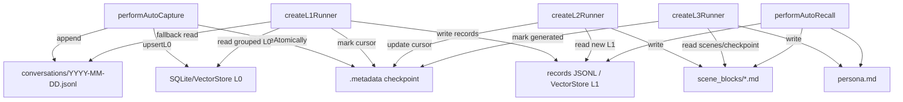

# 04 存储映射

## 状态表

| 状态 | 位置 | 写入方 | 读取方 | 备注 |
| --- | --- | --- | --- | --- |
| L0 原始对话 | `<dataDir>/conversations/YYYY-MM-DD.jsonl` | `recordConversation()` | L1 JSONL fallback, conversation search fallback | 每行一个 message。 |
| L0 检索索引 | data dir 下的 SQLite/VectorStore | `performAutoCapture()` via `upsertL0()` | `executeConversationSearch()` | FTS/vector 能力取决于 store。 |
| L1 结构化记录 | `<dataDir>/records/YYYY-MM-DD.jsonl`，也可能写入 VectorStore L1 | `extractL1Memories()` | `executeMemorySearch()`, L2 runner | 结构化长期记忆。 |
| L2 场景块 | `<dataDir>/scene_blocks/*.md` | `SceneExtractor` | `performAutoRecall()` scene navigation | 场景画像与归并。 |
| Scene index | `<dataDir>/.metadata/*scene*` | scene extraction/index writer | `readSceneIndex()` | 文件名由 scene 模块管理。 |
| L3 用户画像 | `<dataDir>/persona.md` | `PersonaGenerator` | `performAutoRecall()` | 稳定用户画像。 |
| Pipeline checkpoint | `<dataDir>/.metadata/checkpoint*` | `CheckpointManager` | Core scheduler restore, L1/L2 cursors | 保存 cursor 和 pipeline states。 |
| Store manifest | `<dataDir>/.metadata/manifest*` | `pipeline-factory.ts:initStores()` | init drift detection | 记录 store binding。 |
| 进程内 session state | `MemoryPipelineManager.sessionStates` | `notifyConversation`, `runL1/L2` | pipeline timers/runners | 可由 checkpoint 恢复。 |
| 进程内 buffers | `MemoryPipelineManager.messageBuffers` | `notifyConversation()` | `runL1()` | 进程内，重启不可恢复原消息。 |
| Gateway 进程信息 | `~/.codex/tdai-memory/runtime/gateway.pid`, `gateway.json` | CLI runtime | watchdog / install debug | Codex/Claude CLI 旁路进程。 |
| Heartbeat | `~/.codex/tdai-memory/runtime/heartbeat.json` | CLI `touch_heartbeat()` | idle watchdog | 最近使用时间和 session list。 |
| Hook log | `~/.codex/tdai-memory/logs/hooks.jsonl` | `hook.py:_write_log()` | human debug | 非核心存储。 |

## 读写图

## 场景前后状态

| 阶段 | 之前 | 之后 |
| --- | --- | --- |
| capture 前 | `codex-rhino-bird-session` 没有 L0 行 | 追加两条 L0 JSONL |
| L0 index 后 | 原始 turn 不可检索 | L0 FTS/vector 包含 user 与 assistant 内容 |
| L1 后 | Rhino-Bird prompt 没有结构化事实 | records 包含中文偏好和原始代码不改约束 |
| L2 后 | 插件架构讨论没有 scene | scene block 汇总 adapter/Core 约束 |
| L3 后 | persona 缺失或过期 | persona 包含中文、结论优先、工程约束等稳定偏好 |

## 代码锚点

| 状态 | 代码锚点 |
| --- | --- |
| Data directory creation | `src/utils/pipeline-factory.ts:initDataDirectories()` |
| L0 JSONL write | `src/core/conversation/l0-recorder.ts:recordConversation()` |
| L0 vector index | `src/core/hooks/auto-capture.ts:performAutoCapture()` |
| Checkpoint atomic capture | `src/utils/checkpoint.ts:CheckpointManager.captureAtomically()` |
| Store init | `src/utils/pipeline-factory.ts:initStores()` |
| L1 extraction | `src/utils/pipeline-factory.ts:createL1Runner()` |
| L2 extraction | `src/utils/pipeline-factory.ts:createL2Runner()` |
| L3 persona | `src/utils/pipeline-factory.ts:createL3Runner()` |
| Recall read | `src/core/hooks/auto-recall.ts:performAutoRecall()` |
