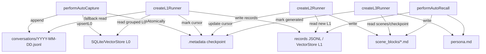

# 04 Storage Map

## State Table

| State | Location | Writer | Reader | Notes |
| --- | --- | --- | --- | --- |
| L0 raw conversations | `<dataDir>/conversations/YYYY-MM-DD.jsonl` | `recordConversation()` | L1 JSONL fallback, conversation search fallback | 每行一个 message。 |
| L0 search index | SQLite/VectorStore under data dir | `performAutoCapture()` via `upsertL0()` | `executeConversationSearch()` | FTS/vector capability取决于 store。 |
| L1 records | `<dataDir>/records/YYYY-MM-DD.jsonl` and/or VectorStore L1 | `extractL1Memories()` | `executeMemorySearch()`, L2 runner | 结构化长期记忆。 |
| L2 scene blocks | `<dataDir>/scene_blocks/*.md` | `SceneExtractor` | `performAutoRecall()` scene navigation | 场景画像与归并。 |
| Scene index | `<dataDir>/.metadata/*scene*` | scene extraction/index writer | `readSceneIndex()` | 文件名由 scene 模块管理。 |
| L3 persona | `<dataDir>/persona.md` | `PersonaGenerator` | `performAutoRecall()` | 稳定用户画像。 |
| Pipeline checkpoint | `<dataDir>/.metadata/checkpoint*` | `CheckpointManager` | Core scheduler restore, L1/L2 cursors | 保存 cursor 和 pipeline states。 |
| Store manifest | `<dataDir>/.metadata/manifest*` | `pipeline-factory.ts:initStores()` | init drift detection | 记录 store binding。 |
| In-memory session state | `MemoryPipelineManager.sessionStates` | `notifyConversation`, `runL1/L2` | pipeline timers/runners | 可由 checkpoint 恢复。 |
| In-memory buffers | `MemoryPipelineManager.messageBuffers` | `notifyConversation()` | `runL1()` | 进程内，重启不可恢复原消息。 |
| Gateway process info | `~/.codex/tdai-memory/runtime/gateway.pid`, `gateway.json` | CLI runtime | watchdog / install debug | Codex/Claude CLI sidecar。 |
| Heartbeat | `~/.codex/tdai-memory/runtime/heartbeat.json` | CLI `touch_heartbeat()` | idle watchdog | 最近使用时间和 session list。 |
| Hook log | `~/.codex/tdai-memory/logs/hooks.jsonl` | `hook.py:_write_log()` | human debug | 非核心存储。 |

## Storage Read/Write Diagram

## Concrete Before / After State

| Step | Before | After |
| --- | --- | --- |
| before capture | no L0 lines for `codex-rhino-bird-session` | two JSONL L0 lines appended |
| after L0 index | no searchable raw turn | L0 FTS/vector contains user and assistant content |
| after L1 | no structured fact for Rhino-Bird prompt | records contain Chinese preference and source-code immutability constraint |
| after L2 | no scene for plugin architecture discussion | scene block summarizes adapter/core constraints |
| after L3 | persona absent or stale | persona includes stable preference for concise Chinese conclusion-first answers |

## Code Anchors

| State | Code anchor |
| --- | --- |
| Data directory creation | `src/utils/pipeline-factory.ts:initDataDirectories()` |
| L0 JSONL write | `src/core/conversation/l0-recorder.ts:recordConversation()` |
| L0 vector index | `src/core/hooks/auto-capture.ts:performAutoCapture()` |
| Checkpoint atomic capture | `src/utils/checkpoint.ts:CheckpointManager.captureAtomically()` |
| Store init | `src/utils/pipeline-factory.ts:initStores()` |
| L1 extraction | `src/utils/pipeline-factory.ts:createL1Runner()` |
| L2 extraction | `src/utils/pipeline-factory.ts:createL2Runner()` |
| L3 persona | `src/utils/pipeline-factory.ts:createL3Runner()` |
| Recall read | `src/core/hooks/auto-recall.ts:performAutoRecall()` |

