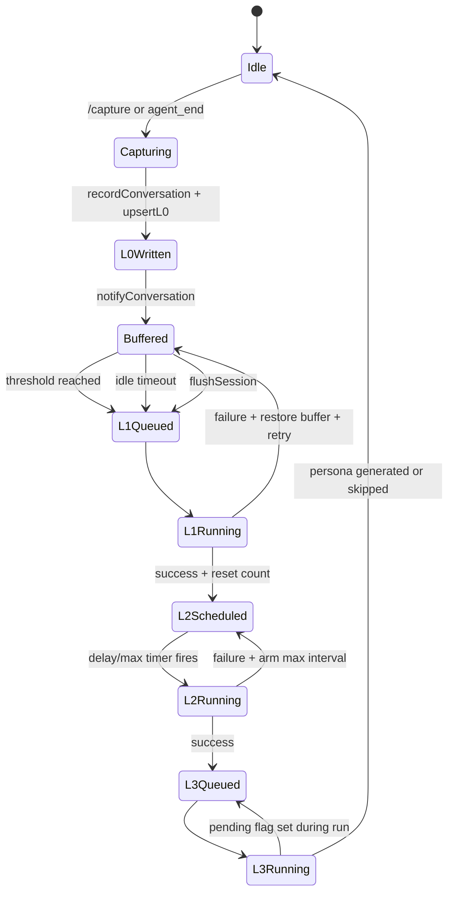
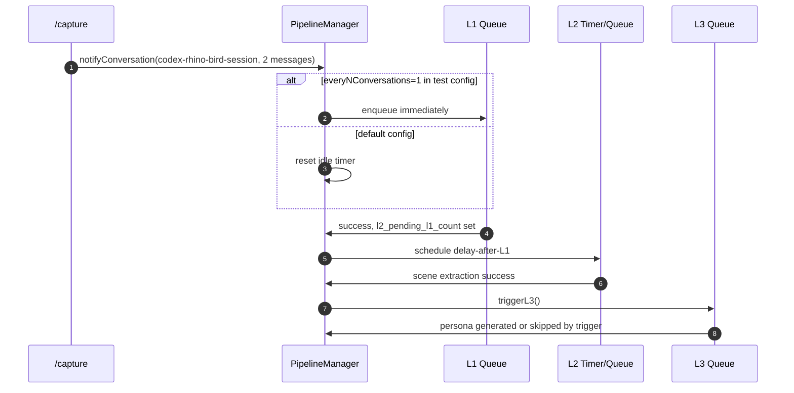

# 05 异步管线

## 异步触发点

| 触发源 | 代码位置 | 异步机制 | 使用的状态 |
| --- | --- | --- | --- |
| L0 embedding 延迟写入 | `auto-capture.ts` | fire-and-forget promise registered in `TdaiCore.bgTasks` | L0 record ids, embedding service |
| Scheduler start | `tdai-core.ts:ensureSchedulerStarted()` | shared promise gate | checkpoint pipeline states |
| L1 threshold | `pipeline-manager.ts:notifyConversation()` | `SerialQueue("L1")` | `conversation_count`, message buffer |
| L1 idle timeout | `ManagedTimer` from `notifyConversation()` | resettable timer | message buffer |
| L1 retry | `runL1()` catch branch | retry timer, max 5 | restored buffer |
| L2 delay-after-L1 | `advanceL2Timer()` | downward-only timer | `l2LastRunTime`, min interval |
| L2 max interval | `armL2MaxInterval()` | periodic timer | active window |
| L3 persona | `triggerL3()` | global serial queue with pending flag | scene/profile checkpoint |
| CLI Gateway watchdog | `runtime.py:ensure_watchdog_running()` | 独立 Python 进程 | heartbeat + gateway pid |
| Hermes watchdog | `MemoryTencentdbProvider._watchdog_loop()` | daemon thread | Gateway health |

## 管线状态图

## Checkpoint 与 cursor

| Cursor 或状态 | 用途 | 更新位置 |
| --- | --- | --- |
| capture cursor | 避免重复捕获同一批 raw messages | `CheckpointManager.captureAtomically()` |
| `last_l1_cursor` | L1 只处理新 L0 messages | `markL1ExtractionComplete()` |
| `last_scene_name` | L1 extraction 的连续场景上下文 | `markL1ExtractionComplete()` |
| `conversation_count` | 判断是否触发 L1 threshold | `notifyConversation()`, `runL1()` |
| `l2_pending_l1_count` | 标记 L1 后 L2 待处理量 | `runL1()`, `runL2()` |
| `last_extraction_updated_time` | L2 增量读取 L1 records | `runL2()` |
| `total_processed` / persona marker | L3 触发条件 | SceneExtractor / PersonaGenerator |

## 重试、幂等与关闭

| 关注点 | 实现 |
| --- | --- |
| 并发 scheduler start | `TdaiCore.schedulerStartPromise` 让并发 capture 等同一个 start。 |
| 重复 L0 capture | `captureAtomically()` + position slice + timestamp cursor。 |
| L1 失败 | buffer 放回 `messageBuffers`，最多 5 次 retry。 |
| L2 失败 | 不丢状态，重新 arm max interval。 |
| L3 并发 | `l3Running` + `l3Pending`，全局串行。 |
| 单 session end | `flushSession(sessionKey)` 只 flush 当前 session。 |
| 进程关闭 | `destroy()` flush pipeline，drain bg tasks，close store。 |
| Gateway 空闲关闭 | CLI watchdog 读 heartbeat，超过 idle timeout 后关闭 hook 启动的 Gateway。 |

## 场景时间线

