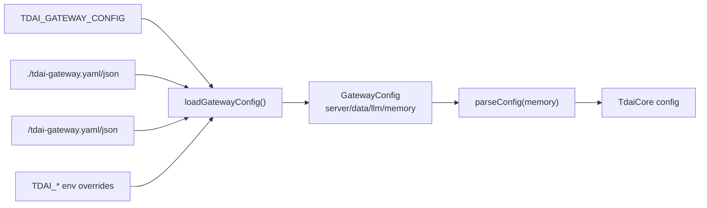

# 06 Config Control Plane

## Gateway Config Resolution

## Behavior-Changing Config

| Config key | Default | Controls |
| --- | --- | --- |
| `server.host` | `127.0.0.1` | Gateway bind address。 |
| `server.port` | `8420` | Gateway HTTP port；Claude install 默认 8421。 |
| `server.apiKey` / `TDAI_GATEWAY_API_KEY` | unset | 非 `/health` 路由 Bearer auth。 |
| `data.baseDir` / `TDAI_DATA_DIR` | `~/.memory-tencentdb/memory-tdai` standalone fallback | L0/L1/L2/L3 落盘目录。 |
| `llm.baseUrl/model/apiKey` | OpenAI defaults | Gateway standalone LLM runner。 |
| `memory.capture.enabled` | `true` | 是否执行 L0 capture。 |
| `memory.extraction.enabled` | `true` | 是否创建 scheduler 和 L1/L2/L3。 |
| `memory.extraction.enableDedup` | `true` | L1 去重。 |
| `memory.pipeline.everyNConversations` | `5` | L1 threshold。 |
| `memory.pipeline.enableWarmup` | `true` | 新 session 阈值 1->2->4 递增。 |
| `memory.pipeline.l1IdleTimeoutSeconds` | `600` | L1 idle 触发。 |
| `memory.pipeline.l2DelayAfterL1Seconds` | `10` | L1 后 L2 delay。 |
| `memory.pipeline.l2MinIntervalSeconds` | `900` | L2 最小间隔。 |
| `memory.pipeline.l2MaxIntervalSeconds` | `3600` | L2 最大轮询间隔。 |
| `memory.recall.enabled` | `true` | 是否 recall 注入。 |
| `memory.recall.strategy` | `hybrid` | keyword / embedding / hybrid。 |
| `memory.recall.maxResults` | `5` | recall topK。 |
| `memory.recall.timeoutMs` | `5000` | recall 超时后跳过注入。 |
| `memory.embedding.provider` | `none` | 默认禁用向量；配置 openai 等启用。 |
| `memory.embedding.dimensions` | `0` when disabled | VectorStore 维度。 |
| `memory.storeBackend` | `sqlite` | SQLite or TCVDB。 |
| `TDAI_GATEWAY_AUTO_START` | CLI/MCP 默认为 false，安装脚本通常写 1 | Gateway 不健康时是否自动启动。 |
| `TDAI_GATEWAY_IDLE_TIMEOUT_SECONDS` | `600` | CLI watchdog idle shutdown。 |

## Why Code May Not Execute

| Symptom | Config reason |
| --- | --- |
| L0 没写 | `memory.capture.enabled=false` 或 hook 没触发/内容被过滤。 |
| L1 没抽取 | `memory.extraction.enabled=false`、无 LLM runner、threshold/idle 未到。 |
| L2/L3 没出来 | L1 无新 records、L2 delay/min interval 未到、PersonaTrigger 不满足。 |
| MCP search 无结果 | L1 尚未产生、embedding/FTS 不可用、query/filters 不匹配。 |
| Gateway 不自动拉起 | `TDAI_GATEWAY_AUTO_START=0` 且无外部 Gateway。 |
| HTTP 401 | Gateway 设置 apiKey，但 client env 未配置同一 token。 |

## Platform Defaults

| Platform | Data dir | Port | Config writer |
| --- | --- | --- | --- |
| Codex | `~/.codex/tdai-memory/data` | `8420` | `scripts/install-codex.sh` |
| Claude Code | `~/.claude/tdai-memory/data` | `8421` | `scripts/install-claude-code.sh` |
| Hermes | Gateway `TDAI_DATA_DIR` or default | `8420` default | Hermes env / Gateway config |
| OpenClaw | OpenClaw state dir + `memory-tdai` | none | OpenClaw plugin config |

