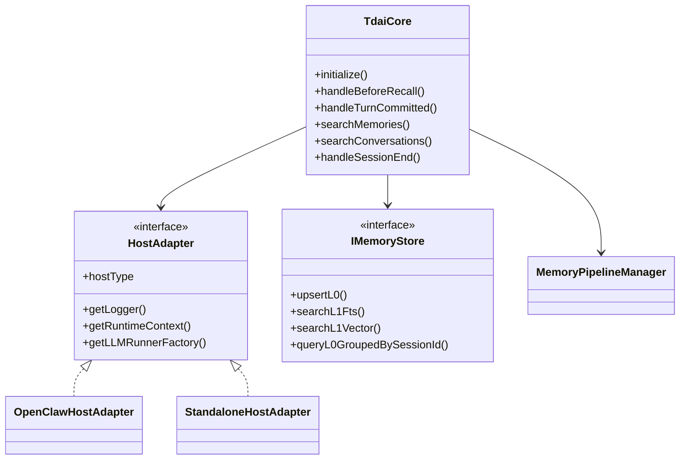
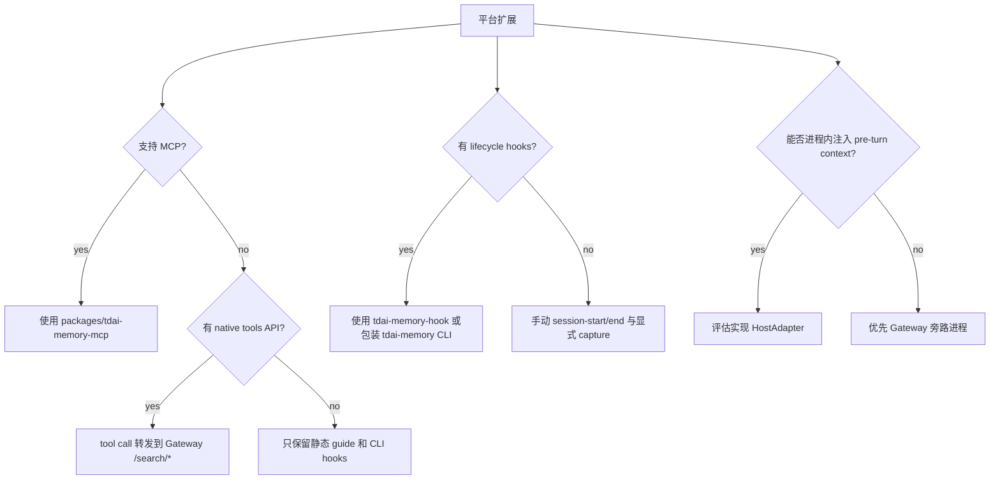

# 07 扩展点

## 扩展点表

| 扩展点 | 用途 | 实现位置 | 使用场景 |
| --- | --- | --- | --- |
| `HostAdapter` | 隔离平台 runtime、logger、LLM runner | `src/adapters/openclaw/host-adapter.ts`, `src/adapters/standalone/host-adapter.ts` | 新平台需要进程内调用 Core。 |
| Gateway HTTP API | 跨语言/跨宿主复用 Core | `src/gateway/server.ts` | 平台只能通过旁路进程接入。 |
| MCP server | Agent 主动检索长期记忆 | `packages/tdai-memory-mcp` | 新 agent 支持 MCP。 |
| CLI/hook wrapper | 生命周期、预取、捕获、flush | `packages/tdai-memory-cli` | 新平台有 hooks 但不支持 prompt 内部改写。 |
| Store backend | 切换本地/云端记忆存储 | `src/core/store/factory.ts`, `IMemoryStore` | 新数据库或向量服务。 |
| Embedding provider | 切换向量模型 | `src/core/store/embedding.ts` 和 factory | 新 OpenAI-compatible embedding。 |
| Recall strategy | keyword / embedding / hybrid | `src/core/hooks/auto-recall.ts`, `src/core/tools/memory-search.ts` | 新排序/融合策略。 |
| L1 runner | 抽取 structured memories | `pipeline-factory.ts:createL1Runner()` | 新抽取方式。 |
| L2 runner | scene extraction | `SceneExtractor`, `createL2Runner()` | 新 scene block 组织方式。 |
| L3 runner | persona synthesis | `PersonaGenerator`, `createL3Runner()` | 新 persona 策略。 |
| Plugin manifest | 安装平台能力 | `plugins/tdai-memory`, `plugins/tdai-memory-claude-code` | 新平台插件包。 |

## 接口与适配图

## 平台扩展判断

## 修改位置

| 需求 | 文件或模块 |
| --- | --- |
| 新增 MCP tool | `packages/tdai-memory-mcp/tdai_memory_mcp/tools.py`，同时保持 Gateway API 对齐 |
| 新增 hook 事件形态 | `packages/tdai-memory-cli/tdai_memory_cli/hook.py` |
| 新增 CLI 命令 | `packages/tdai-memory-cli/tdai_memory_cli/__main__.py` |
| 新增 Gateway route | `src/gateway/server.ts` 和 `src/gateway/types.ts` |
| 新增平台 plugin | `plugins/<platform-name>/` 和安装脚本 |
| 新增 store | `src/core/store/types.ts`, `src/core/store/factory.ts` |
| 新增配置项 | `src/config.ts`, `src/gateway/config.ts`, install scripts/examples |
