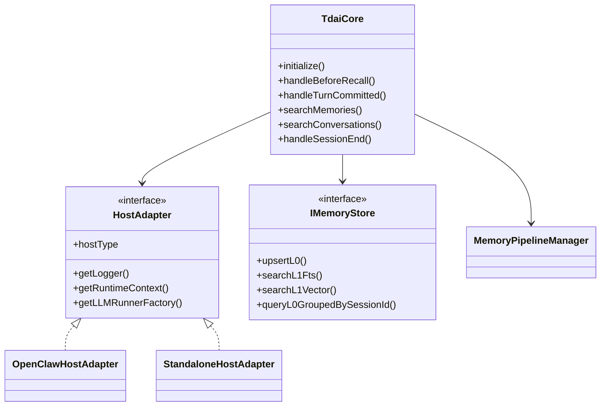
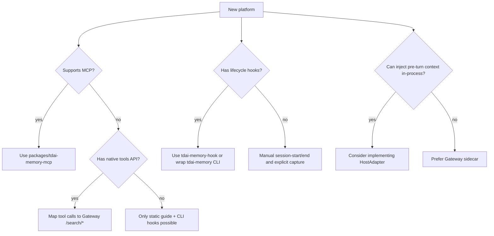

# 07 Extension Points

## Extension Table

| Extension point | Purpose | Implementations / locations | Add here when |
| --- | --- | --- | --- |
| `HostAdapter` | 隔离平台 runtime、logger、LLM runner | `src/adapters/openclaw/host-adapter.ts`, `src/adapters/standalone/host-adapter.ts` | 新平台要进程内调用 Core。 |
| Gateway HTTP API | 跨语言/跨宿主复用 Core | `src/gateway/server.ts` | 平台只能通过 sidecar 接入。 |
| MCP server | Agent 主动检索长期记忆 | `packages/tdai-memory-mcp` | 新 agent 支持 MCP。 |
| CLI/hook wrapper | 生命周期、预取、捕获、flush | `packages/tdai-memory-cli` | 新平台有 hooks 但不支持 prompt 内部改写。 |
| Store backend | 切换本地/云端记忆存储 | `src/core/store/factory.ts`, `IMemoryStore` | 新数据库或向量服务。 |
| Embedding provider | 切换向量模型 | `src/core/store/embedding.ts` and factory | 新 OpenAI-compatible embedding。 |
| Recall strategy | keyword / embedding / hybrid | `src/core/hooks/auto-recall.ts`, `src/core/tools/memory-search.ts` | 新排序/融合策略。 |
| L1 runner | 抽取 structured memories | `pipeline-factory.ts:createL1Runner()` | 新抽取方式。 |
| L2 runner | scene extraction | `SceneExtractor`, `createL2Runner()` | 新 scene block 组织方式。 |
| L3 runner | persona synthesis | `PersonaGenerator`, `createL3Runner()` | 新 persona 策略。 |
| Plugin manifest | 安装平台能力 | `plugins/tdai-memory`, `plugins/tdai-memory-claude-code` | 新平台插件包。 |

## Interface / Adapter Diagram

## New Platform Decision Tree

## Where To Add

| Need | File/module |
| --- | --- |
| Add a new MCP tool | `packages/tdai-memory-mcp/tdai_memory_mcp/tools.py` and keep Gateway API aligned |
| Add a new hook event shape | `packages/tdai-memory-cli/tdai_memory_cli/hook.py` |
| Add a new CLI command | `packages/tdai-memory-cli/tdai_memory_cli/__main__.py` |
| Add a new Gateway route | `src/gateway/server.ts` and `src/gateway/types.ts` |
| Add a new platform plugin | `plugins/<platform-name>/` plus install script |
| Add a new store | `src/core/store/types.ts`, `src/core/store/factory.ts` |
| Add config | `src/config.ts`, `src/gateway/config.ts`, install scripts/examples |

