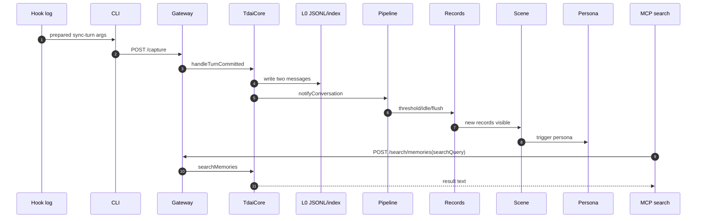
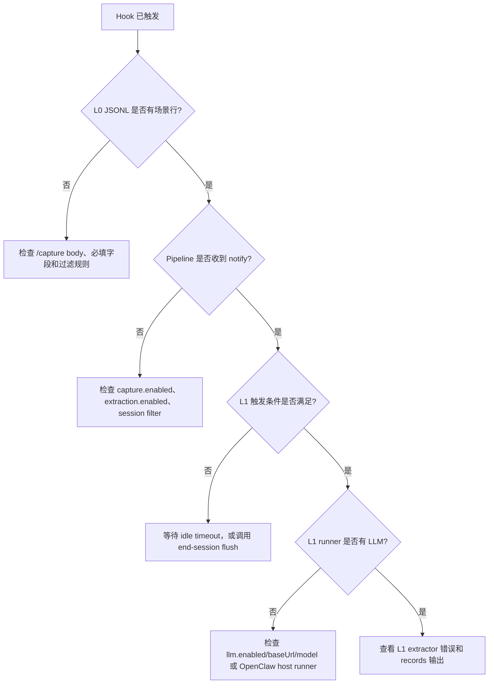

# 08 调试走查

## 场景值

| 字段 | 值 |
| --- | --- |
| `userId` | `小明` |
| `sessionKey` | `codex-rhino-bird-session` |
| `sessionId` | `codex-rhino-bird-session-id` |
| `userPrompt` | `Rhino-Bird 架构拆解测试：请记住小明偏好中文结论优先，并要求 Gateway/Core/Hermes/OpenClaw 原始代码不改。` |
| `assistantContent` | `ACK Rhino-Bird memory architecture scenario.` |
| `searchQuery` | `小明 中文结论优先 Gateway Core Hermes OpenClaw 不改` |

## 调试时序

## 检查步骤

| 步骤 | 检查位置 | 期望现象 |
| --- | --- | --- |
| 1. Hook 触发 | `~/.codex/tdai-memory/logs/hooks.jsonl` 或平台 hook log | `phase=prepared`, `command=sync-turn`，CLI args 含场景文本 |
| 2. CLI 配置 | hook config / plugin manifest 中的 env | `TDAI_GATEWAY_URL=http://127.0.0.1:8420`，auto-start 已启用 |
| 3. Gateway 健康 | `curl /health` 或 gateway log | status 为 `ok` 或 `degraded` |
| 4. Capture route | Gateway log | `Capture completed ... l0=2` |
| 5. Core capture | `tdai-core.ts:handleTurnCommitted()` | scheduler start promise 已等待 |
| 6. L0 写入 | `<dataDir>/conversations/YYYY-MM-DD.jsonl` | user 行包含 `中文结论优先` 和 `原始代码不改` |
| 7. Pipeline notify | Gateway log `[pipeline] notify` | `conversation_count` 增加 |
| 8. L1 run | Gateway log `[l1] Processing` | records 写入，或日志可见 LLM 失败 |
| 9. L2 run | Gateway log `[L2]` | scene block 更新，或日志给出 skipped 原因 |
| 10. L3 run | Gateway log `[L3]` | persona 生成，或判定为 not-needed |
| 11. MCP search | MCP tool result | 返回匹配的 memory 文本 |

## 关键观测值

| 边界 | 期望值 |
| --- | --- |
| Hook CLI args | `sync-turn --user-content <prompt> --assistant-content ACK... --session-key codex-rhino-bird-session` |
| Gateway capture body | `user_content`, `assistant_content`, `session_key`, `session_id`, `messages` |
| L0 JSONL user record | `{"sessionKey":"codex-rhino-bird-session","role":"user","content":"Rhino-Bird 架构拆解测试..."}` |
| Pipeline state | `conversation_count` reaches threshold or idle timer pending |
| L1 record content | 包含“中文结论优先”或“原始代码不改” |
| L2 scene | 插件适配层、核心引擎、工程约束相关场景 |
| L3 persona | 用户偏好中文、结论优先、工程约束意识 |
| MCP result | 返回 N 条匹配记忆，内容与场景文本相关 |

## 分支：hook 已触发但没有 L1

## 结果确认

确认这条链路时看三处：

1. L0: 在 `conversations/YYYY-MM-DD.jsonl` 中能找到 `codex-rhino-bird-session` 和完整 prompt。
2. L1: 用 `小明 中文结论优先 Gateway Core Hermes OpenClaw 不改` 调 `tdai_memory_search`，至少返回一条结构化记忆。
3. L2/L3: scene block 或 `persona.md` 提到稳定偏好/项目约束；如果没有生成，日志里有明确 skip 原因。
