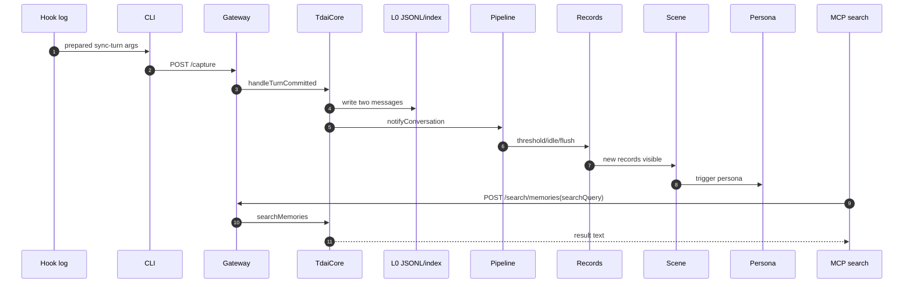
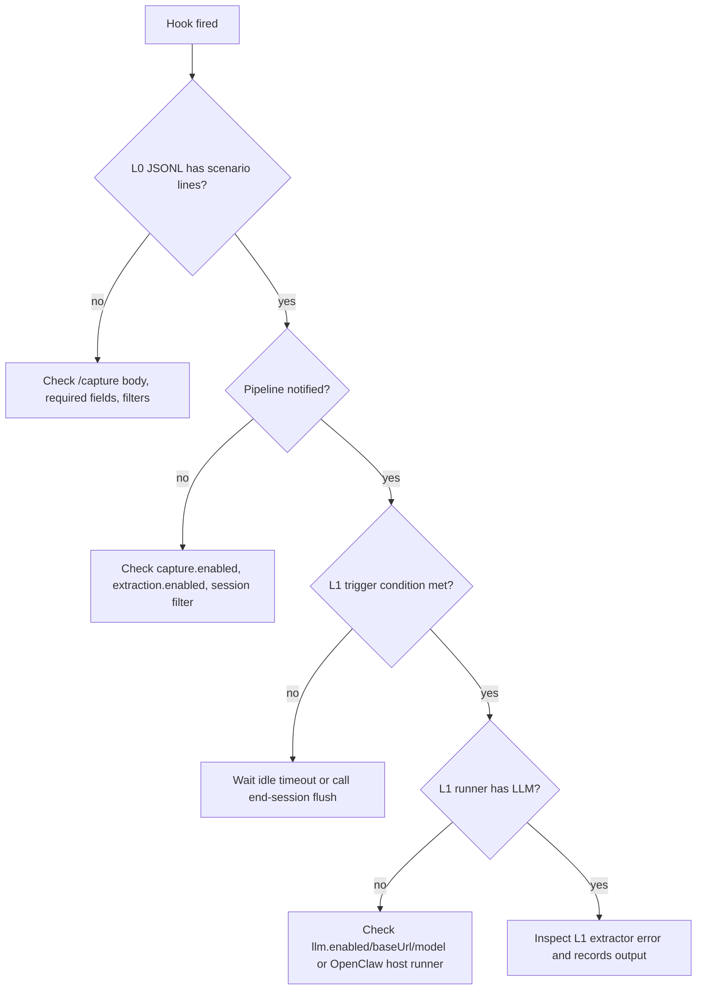

# 08 Debug Walkthrough

## Scenario Values

| 字段 | 值 |
| --- | --- |
| `userId` | `小明` |
| `sessionKey` | `codex-rhino-bird-session` |
| `sessionId` | `codex-rhino-bird-session-id` |
| `userPrompt` | `Rhino-Bird 架构拆解测试：请记住小明偏好中文结论优先，并要求 Gateway/Core/Hermes/OpenClaw 原始代码不改。` |
| `assistantContent` | `ACK Rhino-Bird memory architecture scenario.` |
| `searchQuery` | `小明 中文结论优先 Gateway Core Hermes OpenClaw 不改` |

## Debug Run Sequence

## Step Checklist

| Step | Inspect | Expected |
| --- | --- | --- |
| 1. Hook fired | `~/.codex/tdai-memory/logs/hooks.jsonl` or platform hook log | `phase=prepared`, `command=sync-turn`, CLI args contain scenario text |
| 2. CLI config | env in hook config / plugin manifest | `TDAI_GATEWAY_URL=http://127.0.0.1:8420`, auto-start enabled |
| 3. Gateway healthy | `curl /health` or gateway log | status `ok` or `degraded` |
| 4. Capture route | Gateway log | `Capture completed ... l0=2` |
| 5. Core capture | `tdai-core.ts:handleTurnCommitted()` | scheduler start promise awaited |
| 6. L0 write | `<dataDir>/conversations/YYYY-MM-DD.jsonl` | user line has `中文结论优先` and `原始代码不改` |
| 7. Pipeline notify | Gateway log `[pipeline] notify` | `conversation_count` increments |
| 8. L1 run | Gateway log `[l1] Processing` | records written or LLM failure visible |
| 9. L2 run | Gateway log `[L2]` | scene block updated or skipped reason |
| 10. L3 run | Gateway log `[L3]` | persona generated or not-needed |
| 11. MCP search | MCP tool result | returns matching memory text |

## Observed / Expected Data

| Boundary | Expected value |
| --- | --- |
| Hook CLI args | `sync-turn --user-content <prompt> --assistant-content ACK... --session-key codex-rhino-bird-session` |
| Gateway capture body | `user_content`, `assistant_content`, `session_key`, `session_id`, `messages` |
| L0 JSONL user record | `{"sessionKey":"codex-rhino-bird-session","role":"user","content":"Rhino-Bird 架构拆解测试..."}` |
| Pipeline state | `conversation_count` reaches threshold or idle timer pending |
| L1 record content | 包含“中文结论优先”或“原始代码不改” |
| L2 scene | 插件适配层、核心引擎、工程约束相关场景 |
| L3 persona | 用户偏好中文、结论优先、工程约束意识 |
| MCP result | `Found N matching memories` with relevant content |

## Failure Branch: Hook Fired But No L1

## Proving The Final Result

To prove the chain worked for this scenario:

1. L0 proof: find `codex-rhino-bird-session` and the exact prompt in `conversations/YYYY-MM-DD.jsonl`.
2. L1 proof: `tdai_memory_search` with `小明 中文结论优先 Gateway Core Hermes OpenClaw 不改` returns at least one structured memory.
3. L2/L3 proof: scene block or `persona.md` mentions the stable preference/project constraint, or logs show explicit skip reason.

