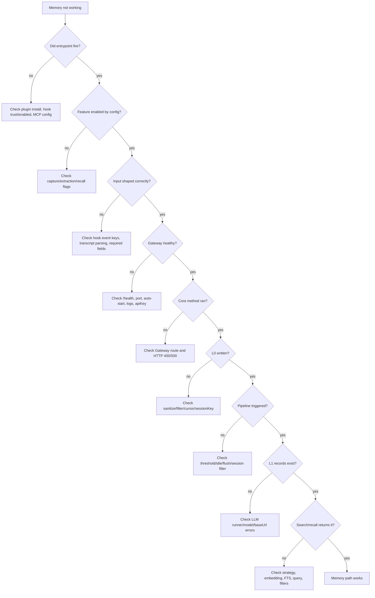

# 09 Debug Playbook

## Decision Tree



## Common Failure Modes

| Symptom | First check | Likely cause |
| --- | --- | --- |
| Hook log empty | platform hook config/trust | hooks not enabled/trusted |
| Hook prepared but no capture | hook stderr / CLI result | event lacks complete turn |
| Gateway not reachable | `TDAI_GATEWAY_URL`, port, pid | wrong port or old process |
| `/capture` 400 | request body | missing `user_content`, `assistant_content`, `session_key` |
| L0 has only one line | hook event only carried one side of turn | transcript parser / Stop event shape |
| L0 exists, L1 absent | Gateway log L1 | threshold/idle not fired or LLM failed |
| L1 exists, L2 absent | `l2DelayAfterL1Seconds`, min interval | timer not fired or no new records |
| L2 exists, L3 absent | PersonaTrigger | trigger interval not satisfied |
| MCP tool asks approval | Codex config plugin tool approval | install config missing/old |
| MCP returns no result | L1 absent or query mismatch | use conversation search to verify L0 |
| Recall injection absent | `recall.enabled`, timeout, no context | `performAutoRecall()` returned undefined |

## First Breakpoints / Logs

| Order | Location |
| --- | --- |
| 1 | `packages/tdai-memory-cli/tdai_memory_cli/hook.py:run_hook()` |
| 2 | `packages/tdai-memory-cli/tdai_memory_cli/__main__.py:run_cli()` |
| 3 | `src/gateway/server.ts:handleRequest()` |
| 4 | `src/core/tdai-core.ts:handleTurnCommitted()` |
| 5 | `src/core/conversation/l0-recorder.ts:recordConversation()` |
| 6 | `src/utils/pipeline-manager.ts:notifyConversation()` |
| 7 | `src/utils/pipeline-manager.ts:runL1()` |
| 8 | `src/utils/pipeline-factory.ts:createL1Runner()` |
| 9 | `packages/tdai-memory-mcp/tdai_memory_mcp/protocol.py:handle_message()` |

## Useful Inspection Commands

```bash
# Find current memory files
find ~/.codex/tdai-memory -maxdepth 4 -type f | sort

# Check hook diagnostics
tail -n 50 ~/.codex/tdai-memory/logs/hooks.jsonl

# Check Gateway logs
tail -n 100 ~/.codex/tdai-memory/logs/gateway.log

# Check raw L0 messages
rg -n "codex-rhino-bird-session|Rhino-Bird|中文结论优先" ~/.codex/tdai-memory/data

# Check Gateway health
curl -sS http://127.0.0.1:8420/health
```

## Debug Order

| Step | Do not skip |
| --- | --- |
| 1 | Confirm hook/MCP entrypoint fired before inspecting Core. |
| 2 | Confirm the active data dir; old repo-local workspace data can mislead. |
| 3 | Confirm L0 before L1; L1 cannot exist without captured input. |
| 4 | Confirm L1 before L2/L3; scene/persona are derived layers. |
| 5 | Use `tdai_conversation_search` when structured memory is empty; it proves L0. |
| 6 | Use Gateway logs to distinguish “not triggered yet” from “triggered and failed”。 |

