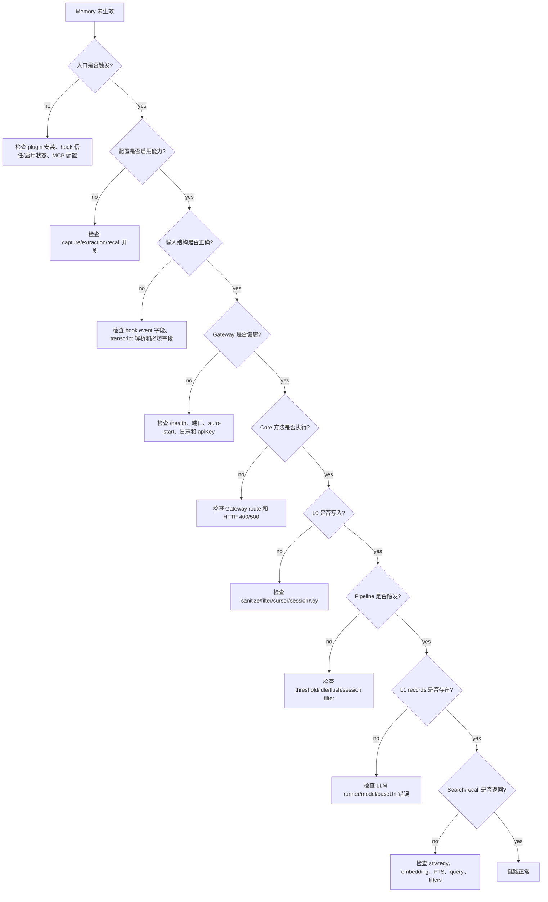

# 09 调试手册

## 判断树



## 常见失败模式

| 现象 | 先看哪里 | 常见原因 |
| --- | --- | --- |
| Hook log 为空 | platform hook config/trust | hooks 未启用或未信任 |
| Hook prepared 但没有 capture | hook stderr / CLI result | event 没带完整 turn |
| Gateway 连不上 | `TDAI_GATEWAY_URL`, port, pid | 端口配置不对，或旧进程还在 |
| `/capture` 400 | request body | missing `user_content`, `assistant_content`, `session_key` |
| L0 has only one line | hook event only carried one side of turn | transcript parser / Stop event shape |
| L0 只有一行 | hook event 只带了 turn 的一侧 | transcript parser / Stop event shape |
| L0 存在，L1 缺失 | Gateway log L1 | threshold/idle 没触发，或 LLM 失败 |
| L1 存在，L2 缺失 | `l2DelayAfterL1Seconds`, min interval | timer 未触发，或没有新 records |
| L2 存在，L3 缺失 | PersonaTrigger | trigger interval 未满足 |
| MCP tool 要求批准 | Codex config plugin tool approval | 安装配置缺失或仍是旧配置 |
| MCP 无结果 | L1 缺失或 query 不匹配 | 用 conversation search 先确认 L0 |
| Recall 注入缺失 | `recall.enabled`, timeout, no context | `performAutoRecall()` 返回 undefined |

## 首批断点和日志

| 顺序 | 位置 |
| --- | --- |
| 1 | `packages/tdai-memory-cli/tdai_memory_cli/hook.py:run_hook()` |
| 2 | `packages/tdai-memory-cli/tdai_memory_cli/__main__.py:run_cli()` |
| 3 | `src/gateway/server.ts:handleRequest()` |
| 4 | `src/core/tdai-core.ts:handleTurnCommitted()` |
| 5 | `src/core/conversation/l0-recorder.ts:recordConversation()` |
| 6 | `src/utils/pipeline-manager.ts:notifyConversation()` |
| 7 | `src/utils/pipeline-manager.ts:runL1()` |
| 8 | `src/utils/pipeline-factory.ts:createL1Runner()` |
| 9 | `packages/tdai-memory-mcp/tdai_memory_mcp/protocol.py:handle_message()` |

## 常用检查命令

```bash
# 当前 memory 文件
find ~/.codex/tdai-memory -maxdepth 4 -type f | sort

# hook 诊断
tail -n 50 ~/.codex/tdai-memory/logs/hooks.jsonl

# Gateway 日志
tail -n 100 ~/.codex/tdai-memory/logs/gateway.log

# 原始 L0 消息
rg -n "codex-rhino-bird-session|Rhino-Bird|中文结论优先" ~/.codex/tdai-memory/data

# Gateway health
curl -sS http://127.0.0.1:8420/health
```

## 排查顺序

| 顺序 | 检查项 |
| --- | --- |
| 1 | 先确认 hook/MCP 入口已触发，再看 Core。 |
| 2 | 确认当前 data dir；旧的 repo-local workspace 数据容易误导。 |
| 3 | 先确认 L0，再查 L1；没有 capture 输入就不会有 L1。 |
| 4 | 先确认 L1，再看 L2/L3；scene/persona 都是派生层。 |
| 5 | 结构化记忆为空时，用 `tdai_conversation_search` 先证明 L0 是否存在。 |
| 6 | 用 Gateway logs 区分“还没触发”和“触发后失败”。 |
