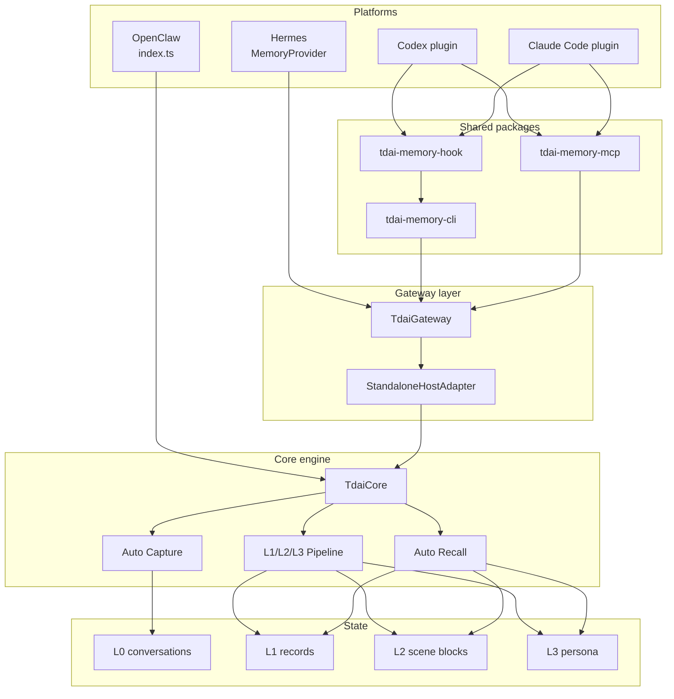
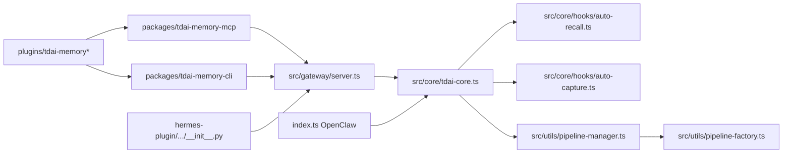

# 10 Visual Map

This file is the diagram index for the dissection package.

## Global Architecture

## Code Anchor Map

## Minimum Reading Order

| Order | File | Why |
| --- | --- | --- |
| 1 | `src/core/tdai-core.ts` | Understand common facade. |
| 2 | `src/gateway/server.ts` | Understand HTTP routes to Core. |
| 3 | `src/core/hooks/auto-capture.ts` | Understand L0 capture and scheduler notify. |
| 4 | `src/utils/pipeline-manager.ts` | Understand L1/L2/L3 timing and queues. |
| 5 | `src/utils/pipeline-factory.ts` | Understand actual L1/L2/L3 runners. |
| 6 | `packages/tdai-memory-mcp/tdai_memory_mcp/protocol.py` | Understand MCP tool path. |
| 7 | `packages/tdai-memory-cli/tdai_memory_cli/hook.py` | Understand hook normalization. |
| 8 | `index.ts` and `hermes-plugin/.../__init__.py` | Understand native platform adapters. |

## HTML Walkthrough

Open `interactive-debug-walkthrough.html` in this directory for a clickable blueprint using the same scenario values as `08-debug-walkthrough.md`.

