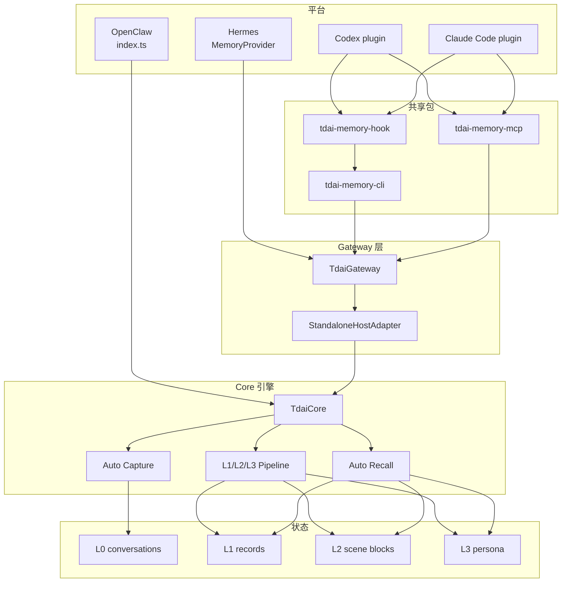
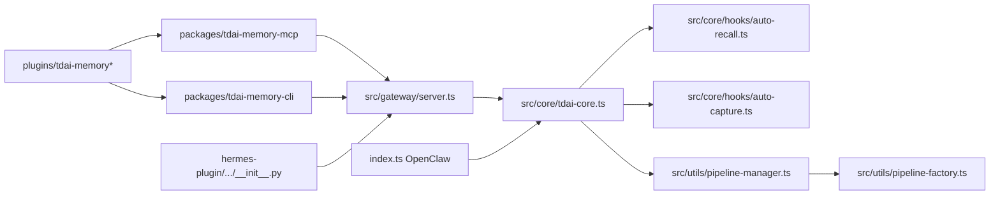

# 10 图索引

本文件汇总源码走查中用到的图。

## 全局架构

## 代码锚点图

## 阅读顺序

| 顺序 | 文件 | 目的 |
| --- | --- | --- |
| 1 | `src/core/tdai-core.ts` | 理解公共 Core facade。 |
| 2 | `src/gateway/server.ts` | 理解 HTTP routes 到 Core 的映射。 |
| 3 | `src/core/hooks/auto-capture.ts` | 理解 L0 capture 和 scheduler notify。 |
| 4 | `src/utils/pipeline-manager.ts` | 理解 L1/L2/L3 时序和队列。 |
| 5 | `src/utils/pipeline-factory.ts` | 理解 L1/L2/L3 runner。 |
| 6 | `packages/tdai-memory-mcp/tdai_memory_mcp/protocol.py` | 理解 MCP tool path。 |
| 7 | `packages/tdai-memory-cli/tdai_memory_cli/hook.py` | 理解 hook normalization。 |
| 8 | `index.ts` 和 `hermes-plugin/.../__init__.py` | 理解平台原生适配层。 |

## HTML 走查页

打开本目录的 `interactive-debug-walkthrough.html`，可以按 `08-debug-walkthrough.md` 中的场景值查看可点击链路图。
