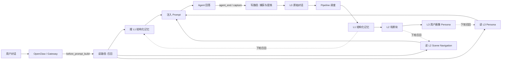
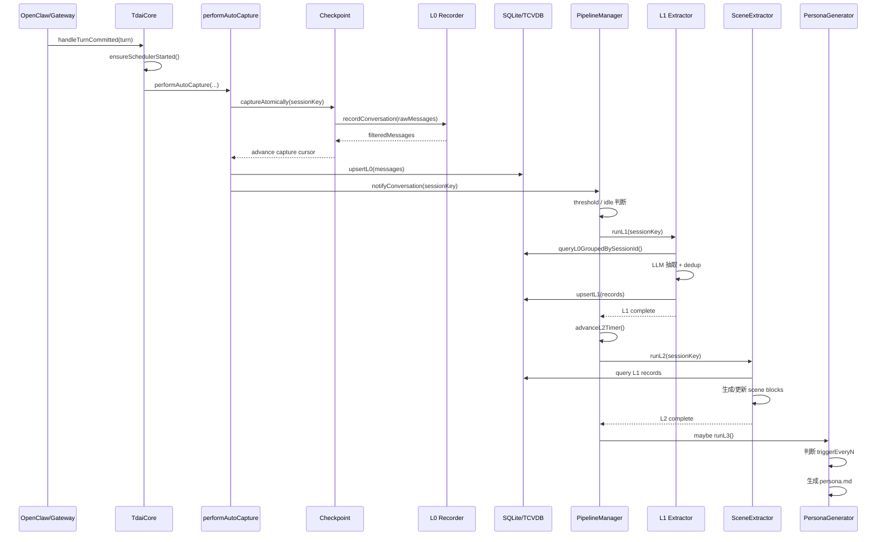
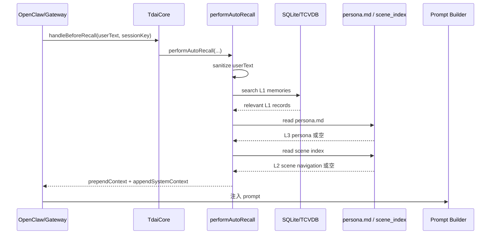
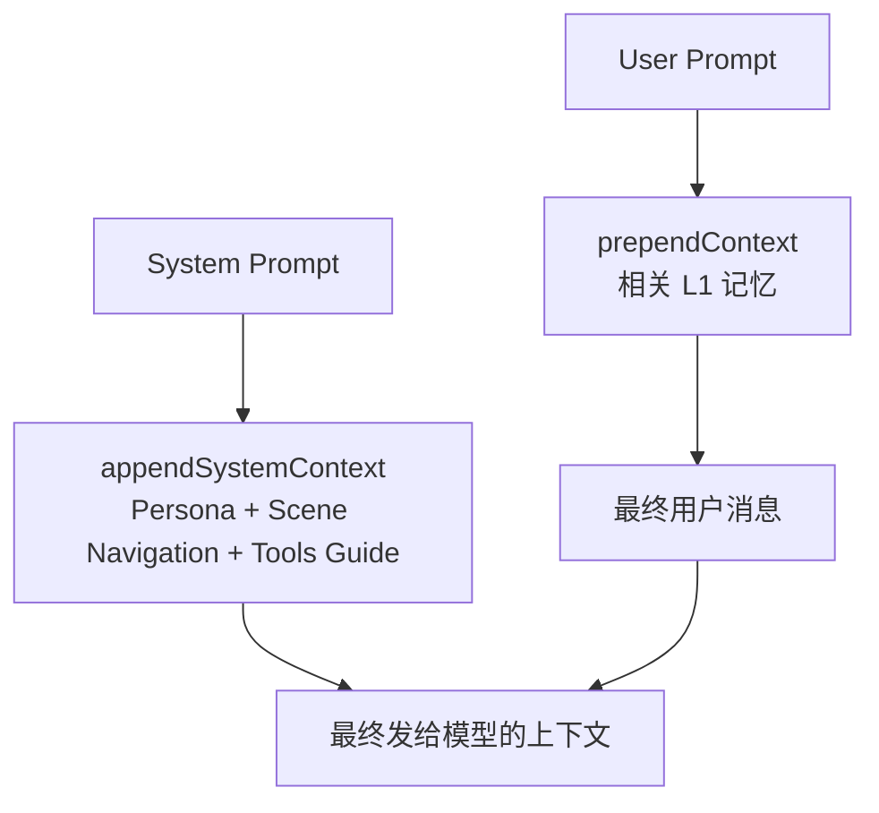
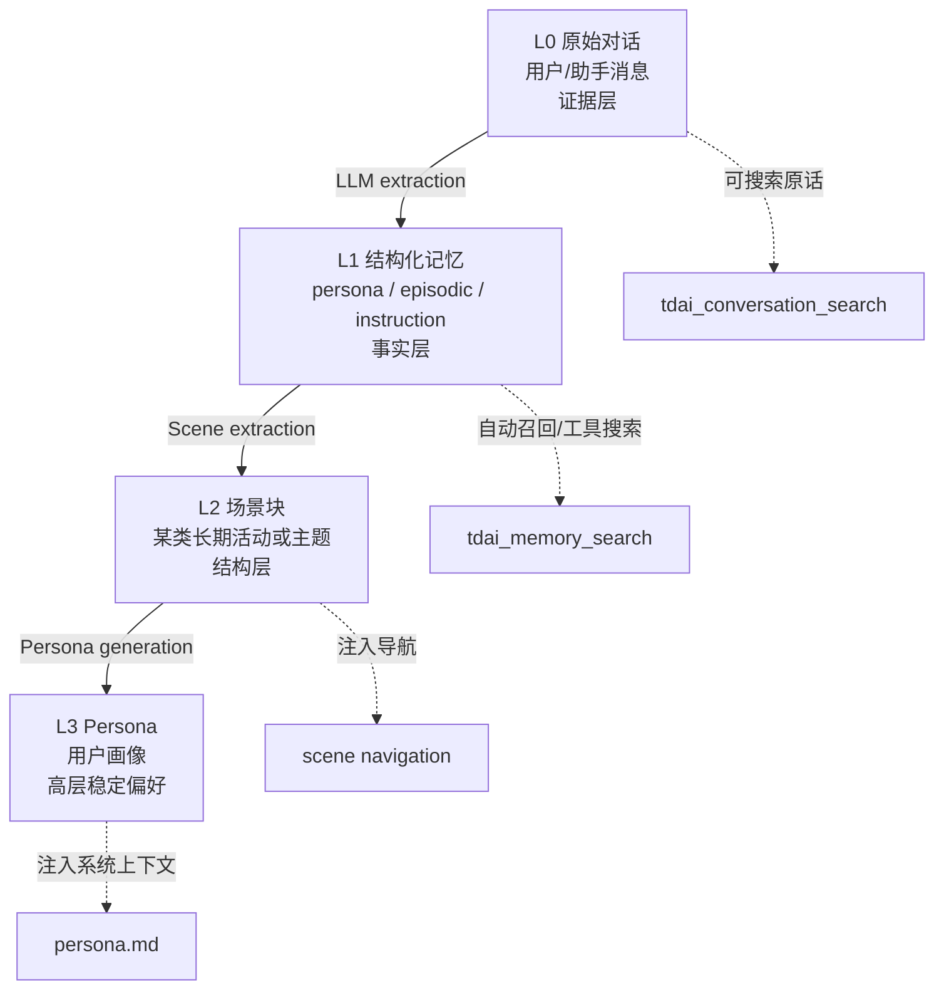
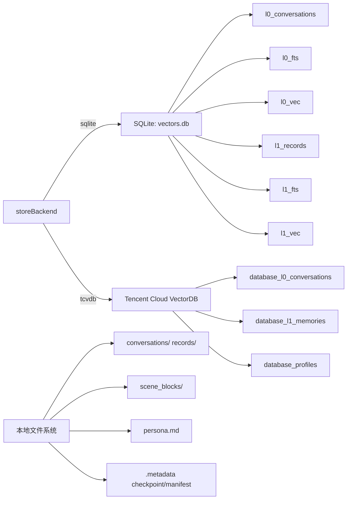
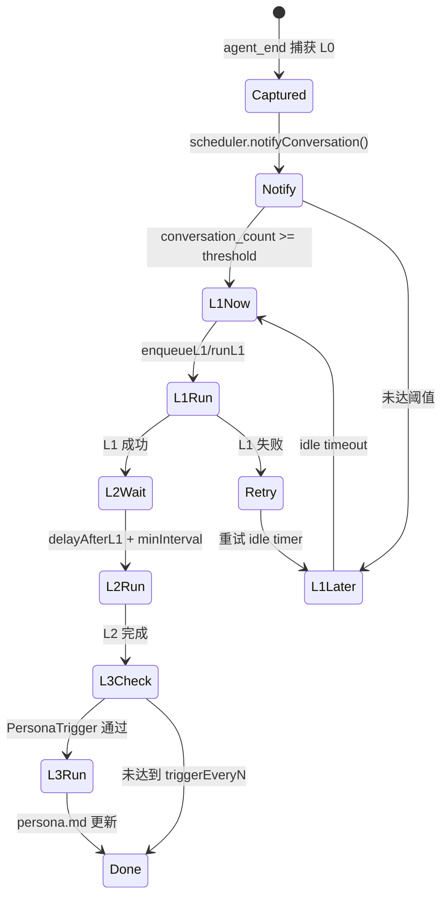
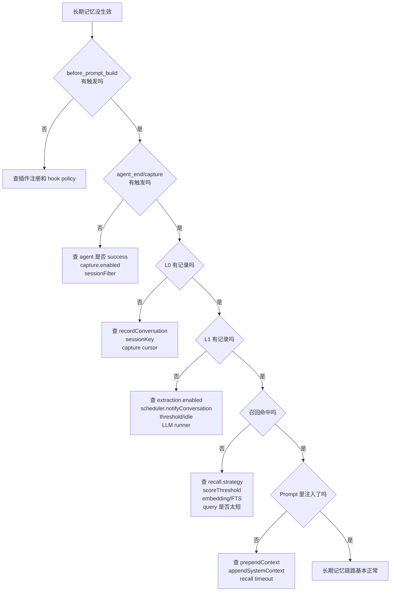
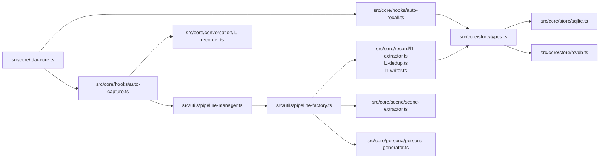

# 长期记忆图版入口

这份只看图，文字尽量少。先按下面顺序看，先建立脑图，再回头查长文。

| 你想看什么 | 看哪张图 |
| --- | --- |
| 长期记忆整体怎么转 | 1. 一张总览图 |
| 一轮对话结束后怎么写记忆 | 2. 写路径 |
| 下一轮对话前怎么召回 | 3. 读路径 |
| L0/L1/L2/L3 分别是什么 | 4. 四层记忆 |
| 数据实际存在哪里 | 5. 数据落在哪里 |
| Pipeline 什么时候触发 | 6. Pipeline 什么时候跑 |
| Debug 应该从哪里查 | 7. Debug 排查树 |
| 代码文件从哪里进 | 8. 关键代码地图 |

## 1. 一张总览图

## 2. 写路径：一轮对话结束后发生什么

## 3. 读路径：下一轮对话前怎么召回

注入位置：

## 4. 四层记忆分别存什么

## 5. 数据落在哪里

## 6. Pipeline 什么时候跑

## 7. Debug 排查树

## 8. 关键代码地图

